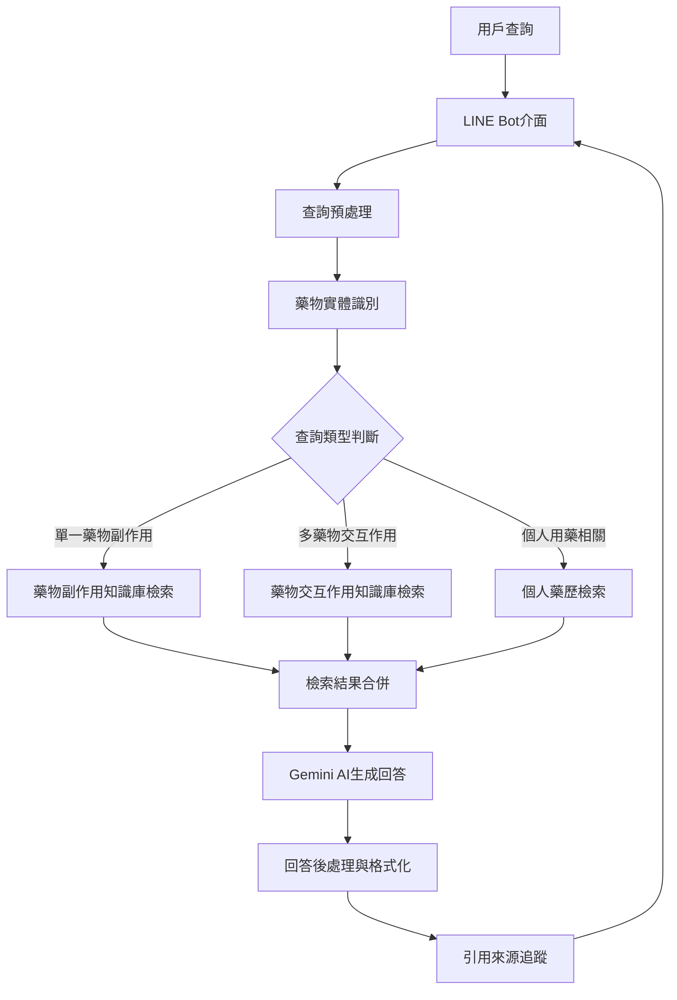
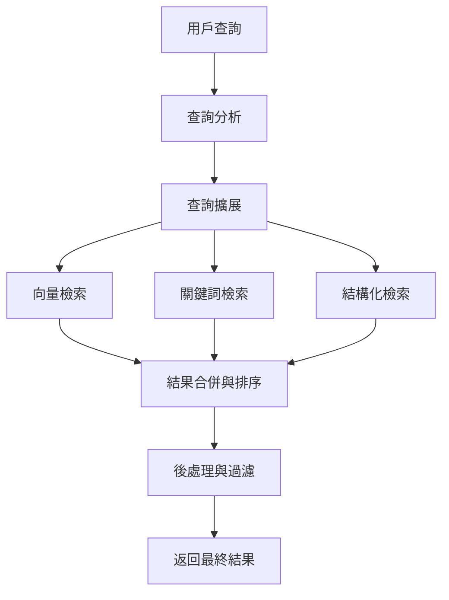
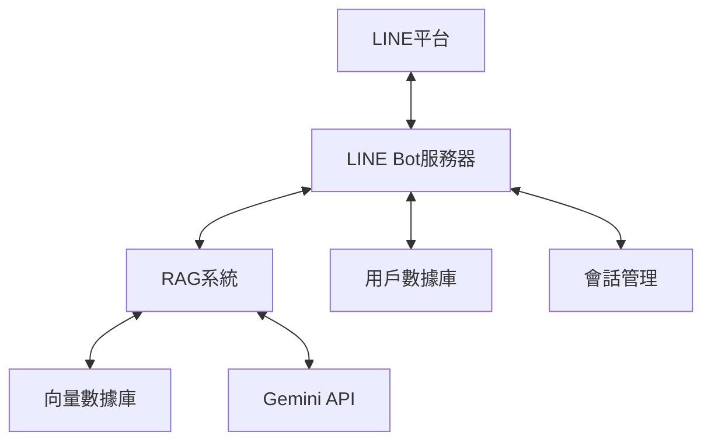

# LINE Bot RAG檢索功能規劃

## 目錄

1. [確定RAG功能的需求和範圍](#1-確定rag功能的需求和範圍)
2. [設計RAG系統架構](#2-設計rag系統架構)
3. [建立知識庫和文檔收集機制](#3-建立知識庫和文檔收集機制)
4. [實現文檔處理和向量化](#4-實現文檔處理和向量化)
5. [建立向量數據庫](#5-建立向量數據庫)
6. [開發檢索系統](#6-開發檢索系統)
7. [整合生成式AI回答](#7-整合生成式ai回答)
8. [設計LINE Bot用戶界面](#8-設計line-bot用戶界面)
9. [實現LINE Bot與RAG系統的整合](#9-實現line-bot與rag系統的整合)
10. [測試和優化RAG功能](#10-測試和優化rag功能)
11. [後續建議](#11-後續建議)

## 1. 確定RAG功能的需求和範圍

根據系統需求，RAG功能定位為「智能藥品顧問」，主要解決以下用戶需求：

1. **藥品資訊查詢**：用戶可以詢問特定藥物的功效、副作用、使用方法等
2. **用藥建議**：提供常見疾病的用藥建議和注意事項
3. **藥物相互作用**：檢查多種藥物之間可能的相互作用
4. **健康知識問答**：回答與健康、疾病和預防相關的問題
5. **個人化用藥提醒**：結合用戶的用藥記錄提供個人化的建議

特別專注於：
- **藥物副作用查詢**：提供準確、詳細的藥物副作用資訊
- **藥物交互作用查詢**：分析多種藥物同時使用的風險和注意事項

這個RAG功能將與現有的藥單辨識、用藥提醒等功能相輔相成，為用戶提供更全面的藥品管理服務。

## 2. 設計RAG系統架構

### 系統架構圖



### 核心組件詳細說明

1. **查詢預處理**
   - 清理用戶輸入
   - 糾正常見藥名拼寫錯誤
   - 停用詞過濾
   - 查詢擴展（同義詞、相關詞）

2. **藥物實體識別**
   - 使用專門的藥物名稱識別模型
   - 支持中文、英文和通用名、商品名識別
   - 將識別到的藥物名稱映射到標準藥物ID

3. **查詢類型判斷**
   - 單一藥物副作用查詢
   - 多藥物交互作用查詢
   - 個人用藥相關查詢

4. **知識庫檢索系統**
   - **藥物副作用知識庫**：專門存儲藥物副作用信息
   - **藥物交互作用知識庫**：專門存儲藥物間的交互作用信息
   - **個人藥歷數據庫**：連接到用戶的藥歷記錄

5. **檢索結果合併**
   - 根據相關性排序檢索結果
   - 合併來自不同知識庫的信息
   - 解決可能的信息衝突

6. **生成回答**
   - 使用Gemini API生成自然語言回答
   - 確保回答準確反映檢索到的信息
   - 添加適當的免責聲明

7. **回答後處理與格式化**
   - 添加視覺元素（如警告標記）
   - 結構化重要信息（如嚴重副作用）
   - 優化LINE消息格式

8. **引用來源追蹤**
   - 記錄信息來源
   - 提供參考資料連結
   - 確保醫療信息可追溯性

### 數據流程

1. 用戶通過LINE Bot發送查詢（例如："阿斯匹靈和布洛芬一起吃有什麼副作用？"）
2. 查詢預處理清理並標準化輸入
3. 藥物實體識別識別出"阿斯匹靈"和"布洛芬"
4. 查詢類型判斷確定這是一個多藥物交互作用查詢
5. 系統檢索藥物交互作用知識庫
6. 檢索結果合併相關信息
7. Gemini AI生成自然語言回答
8. 回答經過格式化，添加警告標記和結構化信息
9. 最終回答返回給用戶，包含引用來源

## 3. 建立知識庫和文檔收集機制

### 資料來源選擇

我建議從以下權威來源收集藥物資訊：

1. **官方藥物資料庫**
   - 台灣衛生福利部食品藥物管理署藥品資料庫
   - 台灣藥品許可證資料庫
   - 中央健康保險署藥品給付資料庫

2. **專業醫藥參考資源**
   - 台灣藥師公會全國聯合會藥品資訊
   - 台灣臨床藥學會資源
   - 醫院藥劑部發布的用藥指南

3. **國際權威資源**（需翻譯成繁體中文）
   - FDA藥物資訊
   - EMA（歐洲藥品管理局）資料
   - Micromedex藥物交互作用資料庫
   - Lexicomp藥物資訊系統

4. **學術文獻**
   - PubMed上的藥物研究
   - 台灣醫學期刊的藥物研究

### 知識庫結構設計

為了有效組織藥物副作用和交互作用資訊，我建議採用以下結構：

```
藥物知識庫/
├── 單一藥物/
│   ├── 藥物ID_1/
│   │   ├── 基本資訊.json
│   │   ├── 副作用.json
│   │   ├── 禁忌症.json
│   │   ├── 使用注意事項.json
│   │   └── 參考資料.json
│   ├── 藥物ID_2/
│   │   └── ...
│   └── ...
├── 藥物交互作用/
│   ├── 藥物ID_1-藥物ID_2.json
│   ├── 藥物ID_1-藥物ID_3.json
│   └── ...
└── 藥物分類/
    ├── 分類_1/
    │   ├── 常見副作用.json
    │   └── 藥物列表.json
    ├── 分類_2/
    │   └── ...
    └── ...
```

### 資料模型設計

#### 1. 單一藥物副作用模型

```json
{
  "drug_id": "TW-12345",
  "generic_name": {
    "zh_TW": "阿斯匹靈",
    "en": "Aspirin"
  },
  "brand_names": [
    {"zh_TW": "百服寧", "en": "Aspirin"},
    {"zh_TW": "阿斯匹靈", "en": "Aspirin"}
  ],
  "side_effects": [
    {
      "severity": "common",
      "description": "胃部不適",
      "frequency": "10-20%",
      "management": "與食物一起服用可減輕此副作用",
      "references": ["衛福部藥品說明書", "台灣藥師公會資料"]
    },
    {
      "severity": "severe",
      "description": "胃出血",
      "frequency": "<1%",
      "warning_signs": ["黑便", "嘔吐物帶血"],
      "management": "立即停藥並就醫",
      "references": ["FDA警告", "臨床研究XYZ"]
    }
  ],
  "contraindications": [...],
  "special_populations": {
    "pregnancy": {...},
    "elderly": {...},
    "children": {...}
  },
  "last_updated": "2025-07-15",
  "data_sources": [...]
}
```

#### 2. 藥物交互作用模型

```json
{
  "interaction_id": "TW-12345-TW-67890",
  "drugs": [
    {
      "drug_id": "TW-12345",
      "name": {"zh_TW": "阿斯匹靈", "en": "Aspirin"}
    },
    {
      "drug_id": "TW-67890",
      "name": {"zh_TW": "布洛芬", "en": "Ibuprofen"}
    }
  ],
  "severity": "moderate",
  "mechanism": "兩種藥物都可能增加胃腸道出血風險，且布洛芬可能降低阿斯匹靈的心血管保護作用",
  "clinical_effects": "增加胃腸道出血風險，可能降低阿斯匹靈的抗血小板效果",
  "recommendations": "避免同時使用。如必須同時使用，應在服用阿斯匹靈至少30分鐘後再服用布洛芬",
  "evidence_level": "A - 多項臨床研究證實",
  "references": [
    {
      "title": "阿斯匹靈與非類固醇消炎藥的交互作用研究",
      "source": "台灣醫學期刊",
      "year": 2023,
      "url": "https://example.com/study123"
    }
  ],
  "last_updated": "2025-07-15"
}
```

### 資料收集與更新機制

1. **初始資料收集**
   - 開發爬蟲程式收集公開藥物資料
   - 與醫療機構合作獲取專業資料
   - 購買商業藥物資料庫授權

2. **資料標準化流程**
   - 藥物名稱標準化（建立通用名、商品名對照表）
   - 副作用嚴重程度分級標準化
   - 交互作用風險等級標準化

3. **定期更新機制**
   - 每月自動檢查官方資料庫更新
   - 每季進行全面資料審核
   - 設置藥物警訊監控，及時更新重要安全信息

4. **資料品質控制**
   - 建立資料審核流程，由藥學專家審核
   - 實施資料一致性檢查
   - 建立用戶反饋機制，收集錯誤報告

### 實現計劃

1. **資料收集階段**（預計時間：1-2個月）
   - 開發資料爬蟲
   - 建立資料清洗流程
   - 完成初始資料收集

2. **資料結構化階段**（預計時間：1個月）
   - 實現資料標準化
   - 建立藥物ID系統
   - 構建資料關聯

3. **知識庫建立階段**（預計時間：1個月）
   - 設計資料庫結構
   - 導入處理後的資料
   - 實現更新機制

4. **資料驗證階段**（預計時間：2週）
   - 進行資料完整性檢查
   - 藥學專家審核
   - 修正問題

### 技術實現

```python
# 資料收集爬蟲示例（偽代碼）
def collect_drug_data_from_fda():
    # 連接FDA資料庫API
    # 下載藥物資料
    # 轉換為標準格式
    return standardized_data

# 藥物資料標準化
def standardize_drug_data(raw_data):
    # 標準化藥物名稱
    # 標準化副作用描述
    # 標準化嚴重程度
    return standardized_data

# 藥物交互作用生成
def generate_drug_interactions(drug_list):
    # 對每對藥物組合
    # 查詢交互作用資料
    # 生成標準化交互作用記錄
    return interaction_data
```

## 4. 實現文檔處理和向量化

### 文檔分割策略

藥物資訊需要適當分割，以便更精確地檢索相關內容。我建議採用以下分割策略：

1. **基於語義的分割**
   - 每個藥物的基本資訊作為一個文檔
   - 每個副作用作為一個獨立文檔
   - 每個藥物交互作用作為一個獨立文檔

2. **分割粒度控制**
   - 單一藥物資訊：200-300字/段
   - 副作用描述：100-200字/段
   - 交互作用描述：300-500字/段

3. **重疊分割**
   - 使用50字的重疊窗口
   - 確保上下文連貫性
   - 避免關鍵信息被分割

```python
def split_drug_document(doc, chunk_size=300, overlap=50):
    """
    將藥物文檔分割成適當大小的片段
    
    Args:
        doc: 藥物文檔
        chunk_size: 每個片段的目標大小
        overlap: 片段間的重疊大小
    
    Returns:
        分割後的文檔片段列表
    """
    chunks = []
    content = doc["content"]
    
    # 檢查是否需要特殊處理
    if doc["type"] == "drug_interaction":
        # 交互作用文檔保持完整
        return [content]
    
    # 一般文檔分割
    for i in range(0, len(content), chunk_size - overlap):
        chunk_end = min(i + chunk_size, len(content))
        chunks.append(content[i:chunk_end])
        
        if chunk_end == len(content):
            break
    
    return chunks
```

### 文檔元數據增強

為了提高檢索效率，我們需要為每個文檔片段添加豐富的元數據：

1. **基本元數據**
   - 文檔ID
   - 藥物ID
   - 文檔類型（基本資訊、副作用、交互作用等）
   - 創建時間和更新時間

2. **語義元數據**
   - 藥物名稱（通用名和商品名）
   - 藥物分類
   - 副作用嚴重程度
   - 交互作用風險等級

3. **檢索增強元數據**
   - 關鍵詞列表
   - 同義詞擴展
   - 常見問題模式

```python
def enhance_document_metadata(chunk, original_doc):
    """
    為文檔片段添加元數據
    
    Args:
        chunk: 文檔片段
        original_doc: 原始文檔
    
    Returns:
        增強後的文檔片段
    """
    enhanced_chunk = {
        "content": chunk,
        "metadata": {
            "doc_id": original_doc["id"],
            "drug_id": original_doc.get("drug_id"),
            "doc_type": original_doc["type"],
            "created_at": original_doc["created_at"],
            "updated_at": original_doc["updated_at"],
            
            # 語義元數據
            "drug_names": original_doc.get("drug_names", []),
            "drug_class": original_doc.get("drug_class"),
            "severity": original_doc.get("severity"),
            "risk_level": original_doc.get("risk_level"),
            
            # 檢索增強
            "keywords": extract_keywords(chunk),
            "synonyms": generate_synonyms(original_doc.get("drug_names", [])),
        }
    }
    
    return enhanced_chunk
```

### 向量化模型選擇

針對中文藥物資訊，我建議使用以下向量化模型：

1. **主要選項：Google 文本嵌入模型**
   - 使用 `text-embedding-gecko` 模型
   - 支援繁體中文
   - 與 Gemini API 整合良好
   - 適合醫療領域文本

2. **備選方案：多語言模型**
   - 使用 `multilingual-e5-large` 模型
   - 支援多語言，包括繁體中文
   - 在醫療文本上表現良好

3. **特殊處理：藥物名稱專用嵌入**
   - 為藥物名稱創建專用嵌入
   - 使用藥物同義詞增強
   - 確保藥物名稱精確匹配

### 向量化流程

```python
import google.generativeai as genai

def vectorize_documents(enhanced_chunks, api_key):
    """
    將增強後的文檔片段向量化
    
    Args:
        enhanced_chunks: 增強後的文檔片段列表
        api_key: Google API 密鑰
    
    Returns:
        向量化後的文檔
    """
    # 配置 API
    genai.configure(api_key=api_key)
    embedding_model = genai.get_embedding_model("text-embedding-gecko")
    
    vectorized_docs = []
    
    for chunk in enhanced_chunks:
        # 準備向量化文本
        content = chunk["content"]
        
        # 添加元數據到文本以增強語義
        if chunk["metadata"]["doc_type"] == "side_effect":
            content = f"藥物副作用: {content}"
        elif chunk["metadata"]["doc_type"] == "drug_interaction":
            content = f"藥物交互作用: {content}"
        
        # 生成向量
        try:
            embedding = embedding_model.embed_content(
                content=content,
                task_type="retrieval_document"
            )
            
            # 添加向量到文檔
            vectorized_doc = chunk.copy()
            vectorized_doc["embedding"] = embedding.values
            vectorized_docs.append(vectorized_doc)
            
        except Exception as e:
            print(f"向量化錯誤: {e}")
            continue
    
    return vectorized_docs
```

### 特殊處理策略

1. **藥物名稱處理**
   - 建立藥物名稱同義詞表
   - 包含通用名、商品名和常見簡稱
   - 為每個藥物名稱生成專用向量

```python
def process_drug_names(drug_names):
    """
    處理藥物名稱，生成同義詞和專用向量
    
    Args:
        drug_names: 藥物名稱列表
    
    Returns:
        處理後的藥物名稱資訊
    """
    processed_names = []
    
    for name in drug_names:
        # 獲取同義詞
        synonyms = get_drug_synonyms(name)
        
        # 生成專用向量
        name_vector = generate_name_vector(name)
        
        processed_names.append({
            "name": name,
            "synonyms": synonyms,
            "vector": name_vector
        })
    
    return processed_names
```

2. **專業術語處理**
   - 建立醫學術語詞典
   - 標準化副作用描述
   - 處理常見縮寫和專業術語

```python
def standardize_medical_terms(text, medical_dictionary):
    """
    標準化醫學術語
    
    Args:
        text: 原始文本
        medical_dictionary: 醫學術語詞典
    
    Returns:
        標準化後的文本
    """
    standardized_text = text
    
    for term, standard_form in medical_dictionary.items():
        standardized_text = standardized_text.replace(term, standard_form)
    
    return standardized_text
```

3. **多語言處理**
   - 處理中英文混合文本
   - 建立中英文藥物名稱對照表
   - 支援中英文混合查詢

### 批量處理與效率優化

1. **批量處理**
   - 使用批量API調用減少請求次數
   - 實現並行處理提高效率
   - 設置重試機制處理API限制

```python
def batch_vectorize(chunks, batch_size=10):
    """
    批量向量化文檔
    
    Args:
        chunks: 文檔片段列表
        batch_size: 批量大小
    
    Returns:
        向量化後的文檔
    """
    all_vectorized = []
    
    for i in range(0, len(chunks), batch_size):
        batch = chunks[i:i+batch_size]
        vectorized_batch = vectorize_batch(batch)
        all_vectorized.extend(vectorized_batch)
        
        # 避免API限制
        time.sleep(1)
    
    return all_vectorized
```

2. **向量緩存**
   - 實現向量緩存機制
   - 只對更新的文檔重新向量化
   - 使用文檔哈希檢測變更

```python
def get_document_hash(doc):
    """計算文檔哈希值"""
    import hashlib
    content = json.dumps(doc, sort_keys=True).encode()
    return hashlib.md5(content).hexdigest()

def vectorize_with_cache(doc, cache):
    """使用緩存向量化文檔"""
    doc_hash = get_document_hash(doc)
    
    if doc_hash in cache:
        return cache[doc_hash]
    
    vector = vectorize_document(doc)
    cache[doc_hash] = vector
    return vector
```

## 5. 建立向量數據庫

針對藥物副作用和藥物交互作用的RAG功能，我們需要建立一個高效的向量數據庫來存儲和檢索向量化後的文檔。以下是詳細的實現計劃：

### 向量數據庫選擇

考慮到專案需求和現有技術棧，我建議以下選項：

1. **主要推薦：Pinecone**
   - 專為向量搜索設計的雲服務
   - 支持高維向量的高效檢索
   - 提供豐富的元數據過濾功能
   - 易於整合到現有系統

2. **備選方案：Milvus**
   - 開源向量數據庫
   - 支持大規模向量數據
   - 可自行部署在現有基礎設施上
   - 提供豐富的索引類型

3. **輕量級選項：Chroma**
   - 輕量級向量數據庫
   - 易於部署和使用
   - 適合中小規模數據
   - Python原生支持

4. **現有數據庫擴展：MySQL + pgvector**
   - 利用現有MySQL數據庫
   - 添加pgvector擴展支持向量操作
   - 減少系統複雜性
   - 適合初期快速實現

### 數據庫架構設計

以Pinecone為例，我們可以設計以下架構：

1. **索引設計**
   - 創建主索引：`drug_knowledge_index`
   - 向量維度：1024（基於選用的嵌入模型）
   - 度量方式：cosine相似度

2. **命名空間設計**
   - `drug_info`：藥物基本信息
   - `side_effects`：藥物副作用
   - `interactions`：藥物交互作用
   - `usage_guidelines`：用藥指南

3. **元數據結構**
   ```json
   {
     "doc_id": "doc_12345",
     "drug_ids": ["TW-12345", "TW-67890"],
     "doc_type": "interaction",
     "severity": "high",
     "last_updated": "2025-07-15",
     "source": "FDA",
     "keywords": ["出血", "胃潰瘍", "併用禁忌"]
   }
   ```

### 實現代碼

```python
import pinecone
import os
from typing import List, Dict, Any

class VectorDatabase:
    def __init__(self, api_key: str, environment: str):
        """初始化向量數據庫"""
        self.api_key = api_key
        self.environment = environment
        self.index_name = "drug_knowledge_index"
        self._initialize()
        
    def _initialize(self):
        """初始化Pinecone連接和索引"""
        pinecone.init(api_key=self.api_key, environment=self.environment)
        
        # 檢查索引是否存在
        if self.index_name not in pinecone.list_indexes():
            # 創建新索引
            pinecone.create_index(
                name=self.index_name,
                dimension=1024,  # 根據嵌入模型調整
                metric="cosine"
            )
            print(f"創建新索引: {self.index_name}")
        
        # 連接到索引
        self.index = pinecone.Index(self.index_name)
        print(f"連接到索引: {self.index_name}")
    
    def upsert_documents(self, vectorized_docs: List[Dict[str, Any]], namespace: str = ""):
        """
        上傳向量化文檔到數據庫
        
        Args:
            vectorized_docs: 向量化後的文檔列表
            namespace: 命名空間
        """
        # 準備上傳數據
        vectors = []
        for doc in vectorized_docs:
            vector_id = doc["metadata"]["doc_id"]
            vector_data = doc["embedding"]
            metadata = doc["metadata"]
            
            vectors.append({
                "id": vector_id,
                "values": vector_data,
                "metadata": metadata
            })
        
        # 批量上傳
        batch_size = 100
        for i in range(0, len(vectors), batch_size):
            batch = vectors[i:i+batch_size]
            self.index.upsert(vectors=batch, namespace=namespace)
            print(f"上傳批次 {i//batch_size + 1}/{(len(vectors)-1)//batch_size + 1}")
    
    def delete_documents(self, doc_ids: List[str], namespace: str = ""):
        """
        刪除文檔
        
        Args:
            doc_ids: 要刪除的文檔ID列表
            namespace: 命名空間
        """
        self.index.delete(ids=doc_ids, namespace
    def query(self, query_vector: List[float], top_k: int = 5, namespace: str = "", 
              filter_dict: Dict[str, Any] = None):
        """
        查詢向量數據庫
        
        Args:
            query_vector: 查詢向量
            top_k: 返回的最相似文檔數量
            namespace: 命名空間
            filter_dict: 元數據過濾條件
            
        Returns:
            相似文檔列表
        """
        results = self.index.query(
            vector=query_vector,
            top_k=top_k,
            namespace=namespace,
            filter=filter_dict,
            include_metadata=True
        )
        
        return results
    
    def get_stats(self):
        """獲取索引統計信息"""
        return self.index.describe_index_stats()
    
    def close(self):
        """關閉連接"""
        # 在Pinecone中不需要顯式關閉連接
        pass


# 使用示例
def vector_db_example():
    # 初始化向量數據庫
    db = VectorDatabase(
        api_key=os.getenv("PINECONE_API_KEY"),
        environment="asia-southeast1-gcp"
    )
    
    # 上傳文檔
    db.upsert_documents(vectorized_docs, namespace="side_effects")
    
    # 查詢
    results = db.query(
        query_vector=query_vector,
        top_k=3,
        namespace="side_effects",
        filter_dict={"drug_id": "TW-12345"}
    )
    
    # 處理結果
    for match in results.matches:
        print(f"ID: {match.id}, Score: {match.score}")
        print(f"Metadata: {match.metadata}")
```

### 數據同步與備份策略

1. **定期備份**
   - 每日增量備份
   - 每週完整備份
   - 存儲在安全的雲存儲中

2. **數據同步機制**
   - 實時更新關鍵信息（如嚴重副作用警告）
   - 批量更新非關鍵信息
   - 設置更新日誌記錄

3. **災難恢復計劃**
   - 多區域備份
   - 自動故障轉移
   - 恢復測試演練

## 6. 開發檢索系統

檢索系統是RAG功能的核心，負責根據用戶查詢從知識庫中檢索相關信息。我們將實現一個混合檢索系統，結合向量搜索、關鍵詞搜索和結構化搜索的優勢。

### 檢索策略設計

1. **混合檢索架構**



2. **檢索方法比較**

| 檢索方法 | 優勢 | 劣勢 | 適用場景 |
|---------|------|------|---------|
| 向量檢索 | 理解語義相似性<br>處理模糊查詢<br>支持跨語言檢索 | 計算成本高<br>難以解釋結果<br>可能漏掉關鍵詞匹配 | 開放式問題<br>語義理解需求高<br>相似性查詢 |
| 關鍵詞檢索 | 精確匹配<br>計算效率高<br>易於實現和調整 | 無法理解語義<br>依賴詞彙匹配<br>同義詞問題 | 精確查詢<br>已知關鍵詞<br>專業術語搜索 |
| 結構化檢索 | 高精度過濾<br>支持複雜條件<br>利用元數據 | 需要結構化數據<br>查詢複雜<br>缺乏語義理解 | 藥物ID查詢<br>嚴重程度過濾<br>時間範圍查詢 |

3. **混合檢索策略**

- **並行檢索**：同時執行多種檢索方法
- **加權合併**：根據查詢類型動態調整各方法權重
- **級聯檢索**：先用一種方法縮小範圍，再用另一種方法精確查找

### 查詢處理流程

1. **查詢分析**
   - 識別藥物名稱和關鍵詞
   - 判斷查詢意圖和類型
   - 提取查詢參數（如嚴重程度、時間範圍）

```python
def analyze_query(query_text: str) -> Dict[str, Any]:
    """
    分析用戶查詢
    
    Args:
        query_text: 用戶查詢文本
        
    Returns:
        查詢分析結果
    """
    # 識別藥物名稱
    drug_names = identify_drug_names(query_text)
    
    # 提取關鍵詞
    keywords = extract_keywords(query_text)
    
    # 判斷查詢類型
    query_type = determine_query_type(query_text, drug_names)
    
    # 提取查詢參數
    params = extract_query_parameters(query_text)
    
    return {
        "drug_names": drug_names,
        "keywords": keywords,
        "query_type": query_type,
        "parameters": params
    }
```

2. **查詢擴展**
   - 藥物名稱同義詞擴展
   - 關鍵詞擴展
   - 上下文相關擴展

```python
def expand_query(query_analysis: Dict[str, Any]) -> Dict[str, Any]:
    """
    擴展查詢
    
    Args:
        query_analysis: 查詢分析結果
        
    Returns:
        擴展後的查詢
    """
    expanded_query = query_analysis.copy()
    
    # 藥物名稱同義詞擴展
    expanded_drugs = []
    for drug in query_analysis["drug_names"]:
        synonyms = get_drug_synonyms(drug)
        expanded_drugs.append({
            "original": drug,
            "synonyms": synonyms
        })
    
    # 關鍵詞擴展
    expanded_keywords = []
    for keyword in query_analysis["keywords"]:
        related_terms = get_related_terms(keyword)
        expanded_keywords.append({
            "original": keyword,
            "related": related_terms
        })
    
    expanded_query["expanded_drugs"] = expanded_drugs
    expanded_query["expanded_keywords"] = expanded_keywords
    
    return expanded_query
```

3. **向量檢索實現**

```python
def vector_search(query_text: str, expanded_query: Dict[str, Any], 
                  vector_db: VectorDatabase, top_k: int = 10) -> List[Dict[str, Any]]:
    """
    向量檢索
    
    Args:
        query_text: 原始查詢文本
        expanded_query: 擴展後的查詢
        vector_db: 向量數據庫
        top_k: 返回結果數量
        
    Returns:
        檢索結果列表
    """
    # 生成查詢向量
    query_vector = generate_query_vector(query_text)
    
    # 構建過濾條件
    filter_dict = build_filter_dict(expanded_query)
    
    # 根據查詢類型選擇命名空間
    namespace = select_namespace(expanded_query["query_type"])
    
    # 執行向量檢索
    results = vector_db.query(
        query_vector=query_vector,
        top_k=top_k,
        namespace=namespace,
        filter_dict=filter_dict
    )
    
    # 處理結果
    processed_results = []
    for match in results.matches:
        processed_results.append({
            "id": match.id,
            "score": match.score,
            "content": match.metadata.get("content", ""),
            "metadata": match.metadata
        })
    
    return processed_results
```

4. **關鍵詞檢索實現**

```python
def keyword_search(expanded_query: Dict[str, Any], 
                   elasticsearch_client, top_k: int = 10) -> List[Dict[str, Any]]:
    """
    關鍵詞檢索
    
    Args:
        expanded_query: 擴展後的查詢
        elasticsearch_client: Elasticsearch客戶端
        top_k: 返回結果數量
        
    Returns:
        檢索結果列表
    """
    # 構建Elasticsearch查詢
    es_query = build_elasticsearch_query(expanded_query)
    
    # 選擇索引
    index = select_index(expanded_query["query_type"])
    
    # 執行查詢
    response = elasticsearch_client.search(
        index=index,
        body=es_query,
        size=top_k
    )
    
    # 處理結果
    results = []
    for hit in response["hits"]["hits"]:
        results.append({
            "id": hit["_id"],
            "score": hit["_score"],
            "content": hit["_source"].get("content", ""),
            "metadata": hit["_source"]
        })
    
    return results
```

5. **結構化檢索實現**

```python
def structured_search(expanded_query: Dict[str, Any], 
                      db_client, top_k: int = 10) -> List[Dict[str, Any]]:
    """
    結構化檢索
    
    Args:
        expanded_query: 擴展後的查詢
        db_client: 數據庫客戶端
        top_k: 返回結果數量
        
    Returns:
        檢索結果列表
    """
    # 構建SQL查詢
    sql_query = build_sql_query(expanded_query)
    
    # 執行查詢
    cursor = db_client.cursor()
    cursor.execute(sql_query)
    rows = cursor.fetchmany(top_k)
    
    # 處理結果
    results = []
    for row in rows:
        results.append({
            "id": row["id"],
            "score": 1.0,  # 結構化查詢沒有相似度分數
            "content": row["content"],
            "metadata": {
                "drug_id": row["drug_id"],
                "doc_type": row["doc_type"],
                "severity": row["severity"],
                # 其他元數據...
            }
        })
    
    return results
```

6. **結果合併與排序**

```python
def merge_and_rank_results(vector_results: List[Dict[str, Any]],
                          keyword_results: List[Dict[str, Any]],
                          structured_results: List[Dict[str, Any]],
                          query_type: str,
                          top_k: int = 5) -> List[Dict[str, Any]]:
    """
    合併和排序檢索結果
    
    Args:
        vector_results: 向量檢索結果
        keyword_results: 關鍵詞檢索結果
        structured_results: 結構化檢索結果
        query_type: 查詢類型
        top_k: 返回結果數量
        
    Returns:
        合併排序後的結果
    """
    # 根據查詢類型設置權重
    weights = get_weights_by_query_type(query_type)
    
    # 合併結果
    all_results = {}
    
    # 添加向量結果
    for result in vector_results:
        doc_id = result["id"]
        if doc_id not in all_results:
            all_results[doc_id] = result.copy()
            all_results[doc_id]["final_score"] = result["score"] * weights["vector"]
        else:
            all_results[doc_id]["final_score"] += result["score"] * weights["vector"]
    
    # 添加關鍵詞結果
    for result in keyword_results:
        doc_id = result["id"]
        if doc_id not in all_results:
            all_results[doc_id] = result.copy()
            all_results[doc_id]["final_score"] = result["score"] * weights["keyword"]
        else:
            all_results[doc_id]["final_score"] += result["score"] * weights["keyword"]
    
    # 添加結構化結果
    for result in structured_results:
        doc_id = result["id"]
        if doc_id not in all_results:
            all_results[doc_id] = result.copy()
            all_results[doc_id]["final_score"] = result["score"] * weights["structured"]
        else:
            all_results[doc_id]["final_score"] += result["score"] * weights["structured"]
    
    # 排序結果
    ranked_results = sorted(
        all_results.values(),
        key=lambda x: x["final_score"],
        reverse=True
    )
    
    # 返回前top_k個結果
    return ranked_results[:top_k]
```

7. **後處理與過濾**

```python
def postprocess_results(ranked_results: List[Dict[str, Any]], 
                        expanded_query: Dict[str, Any]) -> List[Dict[str, Any]]:
    """
    後處理檢索結果
    
    Args:
        ranked_results: 排序後的結果
        expanded_query: 擴展後的查詢
        
    Returns:
        後處理後的結果
    """
    processed_results = []
    
    for result in ranked_results:
        # 過濾不相關結果
        if not is_relevant(result, expanded_query):
            continue
        
        # 提取關鍵片段
        key_passages = extract_key_passages(result["content"], expanded_query)
        
        # 增強結果
        enhanced_result = {
            "id": result["id"],
            "score": result["final_score"],
            "content": result["content"],
            "key_passages": key_passages,
            "metadata": result["metadata"]
        }
        
        processed_results.append(enhanced_result)
    
    return processed_results
```

### 檢索系統整合

```python
class RetrievalSystem:
    def __init__(self, vector_db, elasticsearch_client, db_client):
        """初始化檢索系統"""
        self.vector_db = vector_db
        self.elasticsearch_client = elasticsearch_client
        self.db_client = db_client
    
    def retrieve(self, query_text: str, top_k: int = 5) -> List[Dict[str, Any]]:
        """
        執行檢索
        
        Args:
            query_text: 用戶查詢文本
            top_k: 返回結果數量
            
        Returns:
            檢索結果
        """
        # 查詢分析
        query_analysis = analyze_query(query_text)
        
        # 查詢擴展
        expanded_query = expand_query(query_analysis)
        
        # 向量檢索
        vector_results = vector_search(
            query_text=query_text,
            expanded_query=expanded_query,
            vector_db=self.vector_db,
            top_k=top_k * 2  # 檢索更多結果以便後續合併
        )
        
        # 關鍵詞檢索
        keyword_results = keyword_search(
            expanded_query=expanded_query,
            elasticsearch_client=self.elasticsearch_client,
            top_k=top_k * 2
        )
        
        # 結構化檢索
        structured_results = structured_search(
            expanded_query=expanded_query,
            db_client=self.db_client,
            top_k=top_k * 2
        )
        
        # 結果合併與排序
        ranked_results = merge_and_rank_results(
            vector_results=vector_results,
            keyword_results=keyword_results,
            structured_results=structured_results,
            query_type=query_analysis["query_type"],
            top_k=top_k * 2
        )
        
        # 後處理與過濾
        final_results = postprocess_results(
            ranked_results=ranked_results,
            expanded_query=expanded_query
        )
        
        # 返回前top_k個結果
        return final_results[:top_k]
```

### 檢索系統優化

1. **性能優化**
   - 實現查詢緩存
   - 使用異步處理
   - 批量檢索請求

```python
# 查詢緩存實現
class QueryCache:
    def __init__(self, max_size=1000, ttl=3600):
        """
        初始化查詢緩存
        
        Args:
            max_size: 緩存最大條目數
            ttl: 緩存條目生存時間（秒）
        """
        self.cache = {}
        self.max_size = max_size
        self.ttl = ttl
        self.access_times = {}
    
    def get(self, query_text: str) -> Optional[List[Dict[str, Any]]]:
        """獲取緩存結果"""
        if query_text not in self.cache:
            return None
        
        # 檢查TTL
        timestamp, results = self.cache[query_text]
        if time.time() - timestamp > self.ttl:
            del self.cache[query_text]
            del self.access_times[query_text]
            return None
        
        # 更新訪問時間
        self.access_times[query_text] = time.time()
        
        return results
    
    def set(self, query_text: str, results: List[Dict[str, Any]]):
        """設置緩存結果"""
        # 檢查緩存大小
        if len(self.cache) >= self.max_size:
            # 移除最久未訪問的條目
            oldest_query = min(self.access_times.items(), key=lambda x: x[1])[0]
            del self.cache[oldest_query]
            del self.access_times[oldest_query]
        
        # 添加新條目
        self.cache[query_text] = (time.time(), results)
        self.access_times[query_text] = time.time()
```

2. **準確性優化**
   - 實現反饋機制
   - 動態調整權重
   - A/B測試不同檢索策略

```python
# 反饋機制實現
def update_retrieval_weights(query_text: str, 
                            selected_result_id: str,
                            all_results: List[Dict[str, Any]],
                            current_weights: Dict[str, float]) -> Dict[str, float]:
    """
    根據用戶反饋更新檢索權重
    
    Args:
        query_text: 查詢文本
        selected_result_id: 用戶選擇的結果ID
        all_results: 所有檢索結果
        current_weights: 當前權重
        
    Returns:
        更新後的權重
    """
    # 找到選中的結果
    selected_result = None
    for result in all_results:
        if result["id"] == selected_result_id:
            selected_result = result
            break
    
    if not selected_result:
        return current_weights
    
    # 分析選中結果的來源
    source_scores = {
        "vector": selected_result.get("vector_score", 0),
        "keyword": selected_result.get("keyword_score", 0),
        "structured": selected_result.get("structured_score", 0)
    }
    
    # 計算新權重
    total_score = sum(source_scores.values())
    if total_score == 0:
        return current_weights
    
    # 根據選中結果的來源分數調整權重
    new_weights = {}
    for source, score in source_scores.items():
        # 增加有貢獻的來源權重
        contribution = score / total_score if total_score > 0 else 0
        new_weights[source] = current_weights[source] * (1 + 0.1 * contribution)
    
    # 歸一化權重
    weight_sum = sum(new_weights.values())
    for source in new_weights:
        new_weights[source] /= weight_sum
    
    return new_weights
```

## 7. 整合生成式AI回答

在檢索到相關信息後，我們需要使用生成式AI（如Google Gemini）來生成自然、準確的回答。這一步驟將檢索結果轉化為用戶友好的回答。

### Gemini API整合

1. **API設置與配置**

```python
import google.generativeai as genai
from typing import List, Dict, Any

class GeminiProcessor:
    def __init__(self, api_key: str, model_name: str = "gemini-1.5-pro"):
        """
        初始化Gemini處理器
        
        Args:
            api_key: Google API密鑰
            model_name: Gemini模型名稱
        """
        self.api_key = api_key
        self.model_name = model_name
        self._initialize()
    
    def _initialize(self):
        """初始化Gemini API"""
        genai.configure(api_key=self.api_key)
        self.model = genai.GenerativeModel(self.model_name)
    
    def generate_response(self, 
                         query: str, 
                         retrieval_results: List[Dict[str, Any]],
                         user_info: Dict[str, Any] = None) -> Dict[str, Any]:
        """
        生成回答
        
        Args:
            query: 用戶查詢
            retrieval_results: 檢索結果
            user_info: 用戶信息（可選）
            
        Returns:
            生成的回答
        """
        # 構建提示
        prompt = self._build_prompt(query, retrieval_results, user_info)
        
        # 生成回答
        response = self.model.generate_content(prompt)
        
        # 處理回答
        processed_response = self._process_response(response, retrieval_results)
        
        return processed_response
```

2. **提示工程設計**

```python
def _build_prompt(self, 
                 query: str, 
                 retrieval_results: List[Dict[str, Any]],
                 user_info: Dict[str, Any] = None) -> str:
    """
    構建提示
    
    Args:
        query: 用戶查詢
        retrieval_results: 檢索結果
        user_info: 用戶信息（可選）
        
    Returns:
        構建的提示
    """
    # 基本指令
    prompt = """你是一個專業的藥品顧問，負責提供準確、清晰的藥物信息。請根據提供的檢索結果回答用戶的問題。
    
遵循以下原則：
1. 只使用提供的檢索結果中的信息回答問題
2. 如果檢索結果中沒有足夠信息，坦誠告知用戶
3. 對於藥物副作用和交互作用，按嚴重程度分類並清晰標示
4. 使用專業但易懂的語言
5. 提供信息來源
6. 添加適當的免責聲明

用戶查詢: {query}

檢索結果:
{retrieval_results}

"""
    
    # 添加用戶信息（如果有）
    if user_info:
        prompt += "\n用戶信息:\n"
        if user_info.get("medications"):
            prompt += "當前用藥: " + ", ".join(user_info["medications"]) + "\n"
        if user_info.get("allergies"):
            prompt += "過敏史: " + ", ".join(user_info["allergies"]) + "\n"
        if user_info.get("medical_conditions"):
            prompt += "健康狀況: " + ", ".join(user_info["medical_conditions"]) + "\n"
    
    # 格式化檢索結果
    retrieval_results_text = ""
    for i, result in enumerate(retrieval_results):
        retrieval_results_text += f"[{i+1}] {result.get('content', '')}\n"
        retrieval_results_text += f"來源: {result.get('metadata', {}).get('source', '未知')}\n\n"
    
    # 填充模板
    prompt = prompt.format(
        query=query,
        retrieval_results=retrieval_results_text
    )
    
    return prompt
```

3. **回答處理與增強**

```python
def _process_response(self, 
                     response, 
                     retrieval_results: List[Dict[str, Any]]) -> Dict[str, Any]:
    """
    處理生成的回答
    
    Args:
        response: Gemini API回應
        retrieval_results: 檢索結果
        
    Returns:
        處理後的回答
    """
    # 提取文本回答
    answer_text = response.text
    
    # 提取引用來源
    sources = []
    for result in retrieval_results:
        if result.get("metadata", {}).get("source"):
            source = {
                "title": result.get("metadata", {}).get("title", "未知標題"),
                "source": result.get("metadata", {}).get("source", "未知來源"),
                "url": result.get("metadata", {}).get("url", "")
            }
            if source not in sources:
                sources.append(source)
    
    # 構建結構化回答
    processed_response = {
        "answer": answer_text,
        "sources": sources,
        "disclaimer": "此信息僅供參考，不構成醫療建議。請諮詢醫生或藥師獲取專業意見。"
    }
    
    return processed_response
```

### 回答生成策略

1. **回答模板設計**

為不同類型的查詢設計專門的回答模板：

```python
# 藥物副作用查詢模板
SIDE_EFFECT_TEMPLATE = """
# {drug_name} 副作用信息

## 常見副作用
{common_side_effects}

## 嚴重副作用（需立即就醫）
{severe_side_effects}

## 使用建議
{usage_recommendations}

## 信息來源
{sources}

{disclaimer}
"""

# 藥物交互作用查詢模板
INTERACTION_TEMPLATE = """
# {drug1_name} 與 {drug2_name} 的交互作用

## 風險等級
{risk_level}

## 可能影響
{effects}

## 建議
{recommendations}

## 作用機制
{mechanism}

## 信息來源
{sources}

{disclaimer}
"""
```

2. **回答生成流程**

```python
def generate_structured_answer(query_type: str, 
                              query_analysis: Dict[str, Any],
                              retrieval_results: List[Dict[str, Any]]) -> str:
    """
    生成結構化回答
    
    Args:
        query_type: 查詢類型
        query_analysis: 查詢分析結果
        retrieval_results: 檢索結果
        
    Returns:
        結構化回答
    """
    if query_type == "side_effect":
        return generate_side_effect_answer(query_analysis, retrieval_results)
    elif query_type == "interaction":
        return generate_interaction_answer(query_analysis, retrieval_results)
    elif query_type == "personal":
        return generate_personal_answer(query_analysis, retrieval_results)
    else:
        return generate_general_answer(query_analysis, retrieval_results)

def generate_side_effect_answer(query_analysis: Dict[str, Any],
                               retrieval_results: List[Dict[str, Any]]) -> str:
    """生成藥物副作用回答"""
    drug_name = query_analysis["drug_names"][0]
    
    # 提取常見副作用
    common_side_effects = extract_side_effects(retrieval_results, "common")
    common_side_effects_text = format_side_effects_list(common_side_effects)
    
    # 提取嚴重副作用
    severe_side_effects = extract_side_effects(retrieval_results, "severe")
    severe_side_effects_text = format_side_effects_list(severe_side_effects)
    
    # 提取使用建議
    recommendations = extract_recommendations(retrieval_results)
    recommendations_text = format_
recommendations_text = format_recommendations_list(recommendations)
    
    # 提取來源
    sources = extract_sources(retrieval_results)
    sources_text = format_sources_list(sources)
    
    # 生成免責聲明
    disclaimer = "此信息僅供參考，不構成醫療建議。請諮詢醫生或藥師獲取專業意見。"
    
    # 填充模板
    answer = SIDE_EFFECT_TEMPLATE.format(
        drug_name=drug_name,
        common_side_effects=common_side_effects_text,
        severe_side_effects=severe_side_effects_text,
        usage_recommendations=recommendations_text,
        sources=sources_text,
        disclaimer=disclaimer
    )
    
    return answer
```

3. **回答質量控制**

```python
def validate_answer(answer: str, 
                   retrieval_results: List[Dict[str, Any]],
                   query: str) -> Tuple[bool, str]:
    """
    驗證生成的回答
    
    Args:
        answer: 生成的回答
        retrieval_results: 檢索結果
        query: 用戶查詢
        
    Returns:
        (是否有效, 錯誤信息)
    """
    # 檢查回答是否為空
    if not answer.strip():
        return False, "生成的回答為空"
    
    # 檢查回答是否包含必要的部分
    if "副作用" in query.lower() and "副作用" not in answer.lower():
        return False, "回答未包含副作用信息"
    
    if "交互作用" in query.lower() and "交互作用" not in answer.lower():
        return False, "回答未包含交互作用信息"
    
    # 檢查回答是否包含免責聲明
    if "免責聲明" not in answer.lower() and "disclaimer" not in answer.lower():
        return False, "回答未包含免責聲明"
    
    # 檢查回答是否基於檢索結果
    content_in_retrieval = False
    for result in retrieval_results:
        content = result.get("content", "")
        # 檢查回答中是否包含檢索結果的關鍵片段
        if len(content) > 50:  # 只檢查較長的內容
            key_phrases = extract_key_phrases(content)
            for phrase in key_phrases:
                if phrase in answer:
                    content_in_retrieval = True
                    break
        if content_in_retrieval:
            break
    
    if not content_in_retrieval:
        return False, "回答未基於檢索結果"
    
    return True, ""
```

### 回答增強功能

1. **視覺元素增強**

```python
def enhance_answer_with_visuals(answer: str, 
                               query_analysis: Dict[str, Any],
                               retrieval_results: List[Dict[str, Any]]) -> Dict[str, Any]:
    """
    使用視覺元素增強回答
    
    Args:
        answer: 文本回答
        query_analysis: 查詢分析結果
        retrieval_results: 檢索結果
        
    Returns:
        增強後的回答
    """
    enhanced_answer = {
        "text": answer,
        "visual_elements": []
    }
    
    # 添加警告標記
    if contains_severe_warning(retrieval_results):
        enhanced_answer["visual_elements"].append({
            "type": "warning",
            "title": "重要安全警告",
            "content": extract_severe_warnings(retrieval_results)
        })
    
    # 添加藥物圖片
    drug_names = query_analysis.get("drug_names", [])
    for drug_name in drug_names:
        drug_image = get_drug_image(drug_name)
        if drug_image:
            enhanced_answer["visual_elements"].append({
                "type": "image",
                "title": f"{drug_name}圖片",
                "url": drug_image
            })
    
    # 添加副作用頻率圖表
    if "副作用" in query_analysis.get("keywords", []):
        side_effect_data = extract_side_effect_data(retrieval_results)
        if side_effect_data:
            enhanced_answer["visual_elements"].append({
                "type": "chart",
                "title": "副作用頻率",
                "data": side_effect_data
            })
    
    return enhanced_answer
```

2. **個人化回答**

```python
def personalize_answer(answer: str, 
                      user_info: Dict[str, Any],
                      retrieval_results: List[Dict[str, Any]]) -> str:
    """
    個人化回答
    
    Args:
        answer: 原始回答
        user_info: 用戶信息
        retrieval_results: 檢索結果
        
    Returns:
        個人化後的回答
    """
    personalized_answer = answer
    
    # 添加個人用藥提醒
    if user_info.get("medications"):
        user_medications = user_info["medications"]
        
        # 檢查用戶藥物與查詢藥物的交互作用
        interactions = []
        for medication in user_medications:
            for result in retrieval_results:
                if medication.lower() in result.get("content", "").lower():
                    interactions.append(f"您正在服用的{medication}可能與查詢的藥物有交互作用")
        
        if interactions:
            personalized_section = "\n\n## 個人用藥提醒\n"
            for interaction in interactions:
                personalized_section += f"- {interaction}\n"
            
            personalized_answer += personalized_section
    
    # 添加過敏提醒
    if user_info.get("allergies"):
        user_allergies = user_info["allergies"]
        
        # 檢查過敏原與查詢藥物的關係
        allergy_warnings = []
        for allergy in user_allergies:
            for result in retrieval_results:
                if allergy.lower() in result.get("content", "").lower():
                    allergy_warnings.append(f"您對{allergy}的過敏史可能與此藥物相關")
        
        if allergy_warnings:
            allergy_section = "\n\n## 過敏提醒\n"
            for warning in allergy_warnings:
                allergy_section += f"- {warning}\n"
            
            personalized_answer += allergy_section
    
    return personalized_answer
```

## 8. 設計LINE Bot用戶界面

為了提供良好的用戶體驗，我們需要設計一個直觀、易用的LINE Bot界面，使用戶能夠方便地查詢藥物信息。

### 消息類型設計

1. **文本消息**

```python
def create_text_message(text: str) -> Dict[str, Any]:
    """
    創建文本消息
    
    Args:
        text: 消息文本
        
    Returns:
        LINE文本消息對象
    """
    return {
        "type": "text",
        "text": text
    }
```

2. **Flex消息設計**

```python
def create_drug_info_flex_message(drug_name: str, 
                                 info_type: str,
                                 content: Dict[str, Any]) -> Dict[str, Any]:
    """
    創建藥物信息Flex消息
    
    Args:
        drug_name: 藥物名稱
        info_type: 信息類型（副作用、交互作用等）
        content: 消息內容
        
    Returns:
        LINE Flex消息對象
    """
    if info_type == "side_effect":
        return create_side_effect_flex_message(drug_name, content)
    elif info_type == "interaction":
        return create_interaction_flex_message(drug_name, content)
    else:
        return create_general_info_flex_message(drug_name, content)
```

3. **副作用信息Flex消息**

```python
def create_side_effect_flex_message(drug_name: str, 
                                   content: Dict[str, Any]) -> Dict[str, Any]:
    """
    創建藥物副作用Flex消息
    
    Args:
        drug_name: 藥物名稱
        content: 副作用信息
        
    Returns:
        LINE Flex消息對象
    """
    # 提取內容
    common_side_effects = content.get("common_side_effects", [])
    severe_side_effects = content.get("severe_side_effects", [])
    recommendations = content.get("recommendations", [])
    
    # 構建Flex消息
    bubble = {
        "type": "bubble",
        "header": {
            "type": "box",
            "layout": "vertical",
            "contents": [
                {
                    "type": "text",
                    "text": f"{drug_name} 副作用信息",
                    "weight": "bold",
                    "size": "xl",
                    "color": "#ffffff"
                }
            ],
            "backgroundColor": "#27ACB2"
        },
        "body": {
            "type": "box",
            "layout": "vertical",
            "contents": []
        },
        "footer": {
            "type": "box",
            "layout": "vertical",
            "contents": [
                {
                    "type": "text",
                    "text": "此信息僅供參考，不構成醫療建議",
                    "size": "xs",
                    "color": "#AAAAAA",
                    "wrap": True
                }
            ]
        }
    }
    
    # 添加常見副作用
    if common_side_effects:
        common_section = {
            "type": "box",
            "layout": "vertical",
            "contents": [
                {
                    "type": "text",
                    "text": "常見副作用",
                    "weight": "bold",
                    "size": "md",
                    "margin": "md"
                }
            ],
            "margin": "md"
        }
        
        for effect in common_side_effects:
            common_section["contents"].append({
                "type": "text",
                "text": f"• {effect}",
                "size": "sm",
                "wrap": True,
                "margin": "sm"
            })
        
        bubble["body"]["contents"].append(common_section)
    
    # 添加嚴重副作用
    if severe_side_effects:
        severe_section = {
            "type": "box",
            "layout": "vertical",
            "contents": [
                {
                    "type": "text",
                    "text": "嚴重副作用（需立即就醫）",
                    "weight": "bold",
                    "size": "md",
                    "color": "#FF0000",
                    "margin": "md"
                }
            ],
            "margin": "md"
        }
        
        for effect in severe_side_effects:
            severe_section["contents"].append({
                "type": "text",
                "text": f"• {effect}",
                "size": "sm",
                "wrap": True,
                "margin": "sm",
                "color": "#FF0000"
            })
        
        bubble["body"]["contents"].append(severe_section)
    
    # 添加建議
    if recommendations:
        recommendations_section = {
            "type": "box",
            "layout": "vertical",
            "contents": [
                {
                    "type": "text",
                    "text": "使用建議",
                    "weight": "bold",
                    "size": "md",
                    "margin": "md"
                }
            ],
            "margin": "md"
        }
        
        for recommendation in recommendations:
            recommendations_section["contents"].append({
                "type": "text",
                "text": f"• {recommendation}",
                "size": "sm",
                "wrap": True,
                "margin": "sm"
            })
        
        bubble["body"]["contents"].append(recommendations_section)
    
    # 構建完整消息
    flex_message = {
        "type": "flex",
        "altText": f"{drug_name} 副作用信息",
        "contents": bubble
    }
    
    return flex_message
```

4. **交互作用信息Flex消息**

```python
def create_interaction_flex_message(drug_names: List[str], 
                                   content: Dict[str, Any]) -> Dict[str, Any]:
    """
    創建藥物交互作用Flex消息
    
    Args:
        drug_names: 藥物名稱列表
        content: 交互作用信息
        
    Returns:
        LINE Flex消息對象
    """
    # 提取內容
    risk_level = content.get("risk_level", "未知")
    effects = content.get("effects", [])
    recommendations = content.get("recommendations", [])
    mechanism = content.get("mechanism", "")
    
    # 設置風險等級顏色
    risk_color = "#27ACB2"  # 默認藍色
    if risk_level == "high":
        risk_color = "#FF0000"  # 紅色
    elif risk_level == "moderate":
        risk_color = "#FFA500"  # 橙色
    elif risk_level == "low":
        risk_color = "#008000"  # 綠色
    
    # 構建Flex消息
    bubble = {
        "type": "bubble",
        "header": {
            "type": "box",
            "layout": "vertical",
            "contents": [
                {
                    "type": "text",
                    "text": f"{' 與 '.join(drug_names)} 交互作用",
                    "weight": "bold",
                    "size": "lg",
                    "color": "#ffffff",
                    "wrap": True
                }
            ],
            "backgroundColor": risk_color
        },
        "body": {
            "type": "box",
            "layout": "vertical",
            "contents": [
                {
                    "type": "box",
                    "layout": "vertical",
                    "contents": [
                        {
                            "type": "text",
                            "text": "風險等級",
                            "weight": "bold",
                            "size": "md"
                        },
                        {
                            "type": "text",
                            "text": risk_level,
                            "size": "sm",
                            "margin": "sm",
                            "color": risk_color
                        }
                    ]
                }
            ]
        },
        "footer": {
            "type": "box",
            "layout": "vertical",
            "contents": [
                {
                    "type": "text",
                    "text": "此信息僅供參考，不構成醫療建議",
                    "size": "xs",
                    "color": "#AAAAAA",
                    "wrap": True
                }
            ]
        }
    }
    
    # 添加可能影響
    if effects:
        effects_section = {
            "type": "box",
            "layout": "vertical",
            "contents": [
                {
                    "type": "text",
                    "text": "可能影響",
                    "weight": "bold",
                    "size": "md",
                    "margin": "md"
                }
            ],
            "margin": "md"
        }
        
        for effect in effects:
            effects_section["contents"].append({
                "type": "text",
                "text": f"• {effect}",
                "size": "sm",
                "wrap": True,
                "margin": "sm"
            })
        
        bubble["body"]["contents"].append(effects_section)
    
    # 添加建議
    if recommendations:
        recommendations_section = {
            "type": "box",
            "layout": "vertical",
            "contents": [
                {
                    "type": "text",
                    "text": "建議",
                    "weight": "bold",
                    "size": "md",
                    "margin": "md"
                }
            ],
            "margin": "md"
        }
        
        for recommendation in recommendations:
            recommendations_section["contents"].append({
                "type": "text",
                "text": f"• {recommendation}",
                "size": "sm",
                "wrap": True,
                "margin": "sm"
            })
        
        bubble["body"]["contents"].append(recommendations_section)
    
    # 添加作用機制
    if mechanism:
        mechanism_section = {
            "type": "box",
            "layout": "vertical",
            "contents": [
                {
                    "type": "text",
                    "text": "作用機制",
                    "weight": "bold",
                    "size": "md",
                    "margin": "md"
                },
                {
                    "type": "text",
                    "text": mechanism,
                    "size": "sm",
                    "wrap": True,
                    "margin": "sm"
                }
            ],
            "margin": "md"
        }
        
        bubble["body"]["contents"].append(mechanism_section)
    
    # 構建完整消息
    flex_message = {
        "type": "flex",
        "altText": f"{' 與 '.join(drug_names)} 交互作用",
        "contents": bubble
    }
    
    return flex_message
```

### 用戶交互設計

1. **快速回覆按鈕**

```python
def create_quick_reply_buttons(options: List[str]) -> Dict[str, Any]:
    """
    創建快速回覆按鈕
    
    Args:
        options: 選項列表
        
    Returns:
        快速回覆按鈕對象
    """
    items = []
    
    for option in options:
        items.append({
            "type": "action",
            "action": {
                "type": "message",
                "label": option,
                "text": option
            }
        })
    
    return {
        "items": items
    }
```

2. **引導式查詢流程**

```python
def create_guided_query_flow(flow_type: str) -> List[Dict[str, Any]]:
    """
    創建引導式查詢流程
    
    Args:
        flow_type: 流程類型
        
    Returns:
        消息列表
    """
    messages = []
    
    if flow_type == "side_effect":
        # 藥物副作用查詢流程
        messages.append({
            "type": "text",
            "text": "請輸入您想了解副作用的藥物名稱：",
            "quickReply": create_quick_reply_buttons([
                "阿斯匹靈",
                "布洛芬",
                "乙醯胺酚",
                "其他藥物"
            ])
        })
    
    elif flow_type == "interaction":
        # 藥物交互作用查詢流程
        messages.append({
            "type": "text",
            "text": "請輸入第一種藥物名稱：",
            "quickReply": create_quick_reply_buttons([
                "阿斯匹靈",
                "布洛芬",
                "乙醯胺酚",
                "其他藥物"
            ])
        })
    
    return messages
```

3. **錯誤處理與反饋**

```python
def create_error_message(error_type: str) -> Dict[str, Any]:
    """
    創建錯誤消息
    
    Args:
        error_type: 錯誤類型
        
    Returns:
        錯誤消息對象
    """
    if error_type == "drug_not_found":
        return {
            "type": "text",
            "text": "抱歉，我找不到您提到的藥物。請檢查藥物名稱是否正確，或嘗試使用其他名稱。",
            "quickReply": create_quick_reply_buttons([
                "查看常見藥物列表",
                "重新輸入藥物名稱",
                "聯繫客服"
            ])
        }
    
    elif error_type == "no_information":
        return {
            "type": "text",
            "text": "抱歉，我沒有找到相關信息。請嘗試使用其他關鍵詞或更具體的問題。",
            "quickReply": create_quick_reply_buttons([
                "查看常見問題",
                "重新提問",
                "聯繫客服"
            ])
        }
    
    elif error_type == "system_error":
        return {
            "type": "text",
            "text": "抱歉，系統暫時無法處理您的請求。請稍後再試。",
            "quickReply": create_quick_reply_buttons([
                "重試",
                "聯繫客服"
            ])
        }
    
    return {
        "type": "text",
        "text": "抱歉，發生了未知錯誤。請稍後再試。"
    }
```

### 用戶界面流程

1. **歡迎流程**

```python
def create_welcome_flow() -> List[Dict[str, Any]]:
    """
    創建歡迎流程
    
    Returns:
        消息列表
    """
    messages = []
    
    # 歡迎消息
    messages.append({
        "type": "text",
        "text": "歡迎使用智能藥品顧問！我可以幫您查詢藥物副作用、藥物交互作用以及提供用藥建議。"
    })
    
    # 功能介紹
    bubble = {
        "type": "bubble",
        "header": {
            "type": "box",
            "layout": "vertical",
            "contents": [
                {
                    "type": "text",
                    "text": "我能幫您做什麼？",
                    "weight": "bold",
                    "size": "xl",
                    "color": "#ffffff"
                }
            ],
            "backgroundColor": "#27ACB2"
        },
        "body": {
            "type": "box",
            "layout": "vertical",
            "contents": [
                {
                    "type": "button",
                    "action": {
                        "type": "message",
                        "label": "查詢藥物副作用",
                        "text": "我想查詢藥物副作用"
                    },
                    "style": "primary",
                    "color": "#27ACB2",
                    "margin": "md"
                },
                {
                    "type": "button",
                    "action": {
                        "type": "message",
                        "label": "查詢藥物交互作用",
                        "text": "我想查詢藥物交互作用"
                    },
                    "style": "primary",
                    "color": "#2C87BF",
                    "margin": "md"
                },
                {
                    "type": "button",
                    "action": {
                        "type": "message",
                        "label": "獲取用藥建議",
                        "text": "我想獲取用藥建議"
                    },
                    "style": "primary",
                    "color": "#1D54A7",
                    "margin": "md"
                },
                {
                    "type": "button",
                    "action": {
                        "type": "message",
                        "label": "直接提問",
                        "text": "我想直接提問"
                    },
                    "style": "secondary",
                    "margin": "md"
                }
            ]
        },
        "footer": {
            "type": "box",
            "layout": "vertical",
            "contents": [
                {
                    "type": "text",
                    "text": "您也可以直接輸入您的問題",
                    "size": "sm",
                    "color": "#AAAAAA"
                }
            ]
        }
    }
    
    messages.append({
        "type": "flex",
        "altText": "我能幫您做什麼？",
        "contents": bubble
    })
    
    return messages
```

2. **查詢結果展示**

```python
def create_result_messages(query_result: Dict[str, Any]) -> List[Dict[str, Any]]:
    """
    創建查詢結果消息
    
    Args:
        query_result: 查詢結果
        
    Returns:
        消息列表
    """
    messages = []
    
    # 添加主要回答
    if query_result.get("answer_type") == "side_effect":
        messages.append(
            create_side_effect_flex_message(
                query_result["drug_name"],
                query_result["content"]
            )
        )
    
    elif query_result.get("answer_type") == "interaction":
        messages.append(
            create_interaction_flex_message(
                query_result["drug_names"],
                query_result["content"]
            )
        )
    
    else:
        # 一般文本回答
        messages.append({
            "type": "text",
            "text": query_result["answer"]
        })
    
    # 添加來源信息
    if query_result.get("sources"):
        source_text = "信息來源：\n"
        for source in query_result["sources"]:
            source_text += f"• {source['title']} ({source['source']})\n"
        
        messages.append({
            "type": "text",
            "text": source_text
        })
    
    # 添加後續操作建議
    messages.append({
        "type": "text",
        "text": "還有其他問題嗎？",
        "quickReply": create_quick_reply_buttons([
            "查詢其他藥物",
            "了解更多詳情",
            "返回主菜單"
        ])
    })
    
    return messages
```

## 9. 實現LINE Bot與RAG系統的整合

將RAG系統與LINE Bot整合，實現完整的用戶交互流程。

### 系統整合架構



### 消息處理流程

1. **消息處理器**

```python
from flask import Flask, request, abort
from linebot import LineBotApi, WebhookHandler
from linebot.exceptions import InvalidSignatureError
from linebot.models import MessageEvent, TextMessage

app = Flask(__name__)

line_bot_api = LineBotApi('YOUR_CHANNEL_ACCESS_TOKEN')
handler = WebhookHandler('YOUR_CHANNEL_SECRET')

# 初始化RAG系統
vector_db = VectorDatabase(api_key=os.getenv("PINECONE_API_KEY"), environment="asia-southeast1-gcp")
gemini_processor = GeminiProcessor(api_key=os.getenv("GOOGLE_API_KEY"))
retrieval_system = RetrievalSystem(vector_db=vector_db, elasticsearch_client=None, db_client=None)

@app.route("/callback", methods=['POST'])
def callback():
    # 獲取X-Line-Signature頭部值
    signature = request.headers['X-Line-Signature']

    # 獲取請求體內容
    body = request.get_data(as_text=True)
    app.logger.info("Request body: " + body)

    # 處理webhook主體
    try:
        handler.handle(body, signature)
    except InvalidSignatureError:
        abort(400)

    return 'OK'

@handler.add(MessageEvent, message=TextMessage)
def handle_text_message(event):
    """處理文本消息"""
    user_id = event.source.user_id
    text = event.message.text
    
    # 獲取用戶信息
    user_info = get_user_info(user_id)
    
    # 處理特殊命令
    if text == "我想查詢藥物副作用":
        messages = create_guided_query_flow("side_effect")
        reply_messages(event.reply_token, messages)
        return
    
    elif text == "我想查詢藥物交互作用":
        messages = create_guided_query_flow("interaction")
        reply_messages(event.reply_token, messages)
        return
    
    elif text == "返回主菜單":
        messages = create_welcome_flow()
        reply_messages(event.reply_token, messages)
        return
    
    # 處理一般查詢
    try:
        # 更新會話狀態
        update_conversation_state(user_id, text)
        
        # 處理查詢
        query_result = process_query(text, user_info)
        
        # 創建回覆消息
        messages = create_result_messages(query_result)
        
        # 發送回覆
        reply_messages(event.reply_token, messages)
        
    except Exception as e:
        app.logger.error(f"Error processing message: {e}")
        error_message = create_error_message("system_error")
        reply_messages(event.reply_token, [error_message])

def reply_messages(reply_token, messages):
    """發送回覆消息"""
    line_bot_api.reply_message(reply_token, messages)
```

2. **查詢處理流程**

```python
def
def process_query(query_text: str, user_info: Dict[str, Any] = None) -> Dict[str, Any]:
    """
    處理用戶查詢
    
    Args:
        query_text: 用戶查詢文本
        user_info: 用戶信息
        
    Returns:
        查詢結果
    """
    # 查詢分析
    query_analysis = analyze_query(query_text)
    
    # 檢索相關文檔
    retrieval_results = retrieval_system.retrieve(query_text, top_k=5)
    
    # 生成回答
    response = gemini_processor.generate_response(
        query=query_text,
        retrieval_results=retrieval_results,
        user_info=user_info
    )
    
    # 處理回答類型
    answer_type = "text"
    if "副作用" in query_text.lower() and query_analysis.get("drug_names"):
        answer_type = "side_effect"
    elif "交互作用" in query_text.lower() and len(query_analysis.get("drug_names", [])) >= 2:
        answer_type = "interaction"
    
    # 構建結果
    result = {
        "answer": response["answer"],
        "sources": response["sources"],
        "answer_type": answer_type
    }
    
    # 添加藥物信息
    if answer_type == "side_effect":
        result["drug_name"] = query_analysis["drug_names"][0]
        result["content"] = extract_side_effect_content(response["answer"])
    elif answer_type == "interaction":
        result["drug_names"] = query_analysis["drug_names"][:2]
        result["content"] = extract_interaction_content(response["answer"])
    
    return result
```

3. **會話管理**

```python
# 會話狀態
conversation_states = {}

def update_conversation_state(user_id: str, message: str):
    """
    更新會話狀態
    
    Args:
        user_id: 用戶ID
        message: 用戶消息
    """
    if user_id not in conversation_states:
        conversation_states[user_id] = {
            "state": "initial",
            "context": {},
            "history": []
        }
    
    # 添加消息到歷史記錄
    conversation_states[user_id]["history"].append({
        "role": "user",
        "message": message,
        "timestamp": time.time()
    })
    
    # 根據當前狀態和消息更新狀態
    current_state = conversation_states[user_id]["state"]
    
    if current_state == "initial":
        if "副作用" in message:
            conversation_states[user_id]["state"] = "asking_drug_name"
            conversation_states[user_id]["context"]["query_type"] = "side_effect"
        elif "交互作用" in message:
            conversation_states[user_id]["state"] = "asking_first_drug"
            conversation_states[user_id]["context"]["query_type"] = "interaction"
    
    elif current_state == "asking_drug_name":
        # 假設這是藥物名稱
        conversation_states[user_id]["state"] = "querying"
        conversation_states[user_id]["context"]["drug_name"] = message
    
    elif current_state == "asking_first_drug":
        conversation_states[user_id]["state"] = "asking_second_drug"
        conversation_states[user_id]["context"]["first_drug"] = message
    
    elif current_state == "asking_second_drug":
        conversation_states[user_id]["state"] = "querying"
        conversation_states[user_id]["context"]["second_drug"] = message
    
    elif current_state == "querying":
        # 重置到初始狀態
        conversation_states[user_id]["state"] = "initial"
        conversation_states[user_id]["context"] = {}

def get_conversation_context(user_id: str) -> Dict[str, Any]:
    """
    獲取會話上下文
    
    Args:
        user_id: 用戶ID
        
    Returns:
        會話上下文
    """
    if user_id not in conversation_states:
        return {}
    
    return conversation_states[user_id]["context"]
```

4. **用戶數據管理**

```python
# 用戶數據存儲
user_data = {}

def get_user_info(user_id: str) -> Dict[str, Any]:
    """
    獲取用戶信息
    
    Args:
        user_id: 用戶ID
        
    Returns:
        用戶信息
    """
    if user_id not in user_data:
        # 從數據庫加載用戶數據
        user_data[user_id] = load_user_data_from_db(user_id)
    
    return user_data[user_id]

def load_user_data_from_db(user_id: str) -> Dict[str, Any]:
    """
    從數據庫加載用戶數據
    
    Args:
        user_id: 用戶ID
        
    Returns:
        用戶數據
    """
    # 這裡應該是實際的數據庫查詢
    # 示例數據
    return {
        "user_id": user_id,
        "medications": [],
        "allergies": [],
        "medical_conditions": [],
        "preferences": {
            "language": "zh_TW"
        }
    }

def update_user_data(user_id: str, data: Dict[str, Any]):
    """
    更新用戶數據
    
    Args:
        user_id: 用戶ID
        data: 更新的數據
    """
    if user_id not in user_data:
        user_data[user_id] = load_user_data_from_db(user_id)
    
    # 更新數據
    user_data[user_id].update(data)
    
    # 保存到數據庫
    save_user_data_to_db(user_id, user_data[user_id])

def save_user_data_to_db(user_id: str, data: Dict[str, Any]):
    """
    保存用戶數據到數據庫
    
    Args:
        user_id: 用戶ID
        data: 用戶數據
    """
    # 這裡應該是實際的數據庫保存操作
    pass
```

### 系統配置與部署

1. **環境配置**

```python
# .env 文件
LINE_CHANNEL_ACCESS_TOKEN=your_line_channel_access_token
LINE_CHANNEL_SECRET=your_line_channel_secret
PINECONE_API_KEY=your_pinecone_api_key
PINECONE_ENVIRONMENT=asia-southeast1-gcp
GOOGLE_API_KEY=your_google_api_key
```

2. **Docker配置**

```dockerfile
# Dockerfile
FROM python:3.9-slim

WORKDIR /app

COPY requirements.txt .
RUN pip install --no-cache-dir -r requirements.txt

COPY . .

CMD ["gunicorn", "app:app", "--bind", "0.0.0.0:8080"]
```

```
# docker-compose.yml
version: '3'

services:
  line-bot:
    build: .
    ports:
      - "8080:8080"
    env_file:
      - .env
    restart: always
```

3. **部署流程**

```bash
# 構建Docker鏡像
docker-compose build

# 啟動服務
docker-compose up -d

# 查看日誌
docker-compose logs -f
```

## 10. 測試和優化RAG功能

為了確保RAG功能的準確性和效能，我們需要進行全面的測試和優化。

### 測試策略

1. **單元測試**

```python
import unittest
from unittest.mock import patch, MagicMock

class TestRetrievalSystem(unittest.TestCase):
    def setUp(self):
        # 設置測試環境
        self.vector_db = MagicMock()
        self.elasticsearch_client = MagicMock()
        self.db_client = MagicMock()
        self.retrieval_system = RetrievalSystem(
            vector_db=self.vector_db,
            elasticsearch_client=self.elasticsearch_client,
            db_client=self.db_client
        )
    
    def test_analyze_query(self):
        # 測試查詢分析
        query = "阿斯匹靈有什麼副作用？"
        result = analyze_query(query)
        
        self.assertIn("drug_names", result)
        self.assertIn("阿斯匹靈", result["drug_names"])
        self.assertIn("副作用", result["keywords"])
    
    def test_vector_search(self):
        # 測試向量搜索
        query = "阿斯匹靈有什麼副作用？"
        expanded_query = {
            "drug_names": ["阿斯匹靈"],
            "keywords": ["副作用"],
            "query_type": "side_effect"
        }
        
        # 模擬向量數據庫回應
        mock_results = MagicMock()
        mock_results.matches = [
            MagicMock(id="doc1", score=0.9, metadata={"content": "阿斯匹靈可能導致胃部不適"}),
            MagicMock(id="doc2", score=0.8, metadata={"content": "阿斯匹靈的嚴重副作用包括胃出血"})
        ]
        self.vector_db.query.return_value = mock_results
        
        results = vector_search(query, expanded_query, self.vector_db)
        
        self.assertEqual(len(results), 2)
        self.assertEqual(results[0]["id"], "doc1")
        self.assertEqual(results[0]["score"], 0.9)
        self.assertIn("胃部不適", results[0]["content"])
```

2. **整合測試**

```python
class TestRAGIntegration(unittest.TestCase):
    def setUp(self):
        # 設置測試環境
        self.app = app.test_client()
        
        # 模擬LINE Bot API
        self.line_bot_api_patcher = patch('app.line_bot_api')
        self.mock_line_bot_api = self.line_bot_api_patcher.start()
        
        # 模擬處理器
        self.retrieval_system_patcher = patch('app.retrieval_system')
        self.mock_retrieval_system = self.retrieval_system_patcher.start()
        
        self.gemini_processor_patcher = patch('app.gemini_processor')
        self.mock_gemini_processor = self.gemini_processor_patcher.start()
    
    def tearDown(self):
        # 清理
        self.line_bot_api_patcher.stop()
        self.retrieval_system_patcher.stop()
        self.gemini_processor_patcher.stop()
    
    def test_text_message_handling(self):
        # 模擬檢索結果
        mock_retrieval_results = [
            {"id": "doc1", "content": "阿斯匹靈可能導致胃部不適", "metadata": {"source": "FDA"}}
        ]
        self.mock_retrieval_system.retrieve.return_value = mock_retrieval_results
        
        # 模擬生成回答
        mock_response = {
            "answer": "阿斯匹靈的常見副作用包括胃部不適。",
            "sources": [{"title": "阿斯匹靈說明書", "source": "FDA", "url": ""}]
        }
        self.mock_gemini_processor.generate_response.return_value = mock_response
        
        # 模擬LINE事件
        event = MagicMock()
        event.source.user_id = "test_user"
        event.message.text = "阿斯匹靈有什麼副作用？"
        event.reply_token = "reply_token"
        
        # 調用處理函數
        handle_text_message(event)
        
        # 驗證回覆
        self.mock_line_bot_api.reply_message.assert_called_once()
        args = self.mock_line_bot_api.reply_message.call_args[0]
        self.assertEqual(args[0], "reply_token")
        self.assertIsInstance(args[1], list)
```

3. **端到端測試**

```python
def test_end_to_end():
    """端到端測試"""
    # 初始化實際組件
    vector_db = VectorDatabase(
        api_key=os.getenv("PINECONE_API_KEY"),
        environment=os.getenv("PINECONE_ENVIRONMENT")
    )
    
    gemini_processor = GeminiProcessor(
        api_key=os.getenv("GOOGLE_API_KEY")
    )
    
    retrieval_system = RetrievalSystem(
        vector_db=vector_db,
        elasticsearch_client=None,
        db_client=None
    )
    
    # 測試查詢
    test_queries = [
        "阿斯匹靈有什麼副作用？",
        "阿斯匹靈和布洛芬可以一起吃嗎？",
        "高血壓患者可以服用阿斯匹靈嗎？"
    ]
    
    for query in test_queries:
        print(f"測試查詢: {query}")
        
        # 檢索
        retrieval_results = retrieval_system.retrieve(query, top_k=3)
        print(f"檢索結果數量: {len(retrieval_results)}")
        
        # 生成回答
        response = gemini_processor.generate_response(
            query=query,
            retrieval_results=retrieval_results
        )
        
        print(f"回答: {response['answer'][:100]}...")
        print(f"來源數量: {len(response['sources'])}")
        print("---")
```

### 性能測試與優化

1. **性能測試**

```python
import time
import statistics

def performance_test(num_queries=100):
    """性能測試"""
    # 初始化組件
    vector_db = VectorDatabase(
        api_key=os.getenv("PINECONE_API_KEY"),
        environment=os.getenv("PINECONE_ENVIRONMENT")
    )
    
    retrieval_system = RetrievalSystem(
        vector_db=vector_db,
        elasticsearch_client=None,
        db_client=None
    )
    
    # 測試查詢
    test_queries = [
        "阿斯匹靈有什麼副作用？",
        "阿斯匹靈和布洛芬可以一起吃嗎？",
        "高血壓患者可以服用阿斯匹靈嗎？",
        "布洛芬的常見副作用有哪些？",
        "乙醯胺酚對肝臟有影響嗎？"
    ]
    
    # 測量檢索時間
    retrieval_times = []
    
    for _ in range(num_queries):
        query = random.choice(test_queries)
        
        start_time = time.time()
        retrieval_system.retrieve(query, top_k=3)
        end_time = time.time()
        
        retrieval_times.append(end_time - start_time)
    
    # 計算統計數據
    avg_time = statistics.mean(retrieval_times)
    median_time = statistics.median(retrieval_times)
    p95_time = sorted(retrieval_times)[int(num_queries * 0.95)]
    
    print(f"檢索性能測試結果 ({num_queries} 次查詢):")
    print(f"平均時間: {avg_time:.3f} 秒")
    print(f"中位數時間: {median_time:.3f} 秒")
    print(f"95百分位時間: {p95_time:.3f} 秒")
```

2. **性能優化**

```python
# 實現查詢緩存
class QueryCache:
    def __init__(self, max_size=1000, ttl=3600):
        self.cache = {}
        self.max_size = max_size
        self.ttl = ttl
        self.access_times = {}
    
    def get(self, query_text):
        if query_text not in self.cache:
            return None
        
        timestamp, results = self.cache[query_text]
        if time.time() - timestamp > self.ttl:
            del self.cache[query_text]
            del self.access_times[query_text]
            return None
        
        self.access_times[query_text] = time.time()
        return results
    
    def set(self, query_text, results):
        if len(self.cache) >= self.max_size:
            oldest_query = min(self.access_times.items(), key=lambda x: x[1])[0]
            del self.cache[oldest_query]
            del self.access_times[oldest_query]
        
        self.cache[query_text] = (time.time(), results)
        self.access_times[query_text] = time.time()

# 使用緩存
query_cache = QueryCache()

def process_query_with_cache(query_text, user_info=None):
    # 檢查緩存
    cached_result = query_cache.get(query_text)
    if cached_result:
        return cached_result
    
    # 處理查詢
    result = process_query(query_text, user_info)
    
    # 存入緩存
    query_cache.set(query_text, result)
    
    return result
```

### 準確性評估與優化

1. **準確性評估**

```python
def evaluate_accuracy(test_cases):
    """評估準確性"""
    # 初始化組件
    vector_db = VectorDatabase(
        api_key=os.getenv("PINECONE_API_KEY"),
        environment=os.getenv("PINECONE_ENVIRONMENT")
    )
    
    gemini_processor = GeminiProcessor(
        api_key=os.getenv("GOOGLE_API_KEY")
    )
    
    retrieval_system = RetrievalSystem(
        vector_db=vector_db,
        elasticsearch_client=None,
        db_client=None
    )
    
    results = []
    
    for test_case in test_cases:
        query = test_case["query"]
        expected_info = test_case["expected_info"]
        
        # 檢索
        retrieval_results = retrieval_system.retrieve(query, top_k=5)
        
        # 生成回答
        response = gemini_processor.generate_response(
            query=query,
            retrieval_results=retrieval_results
        )
        
        # 評估回答
        answer = response["answer"]
        
        # 檢查是否包含預期信息
        contains_expected_info = all(info in answer for info in expected_info)
        
        results.append({
            "query": query,
            "answer": answer,
            "contains_expected_info": contains_expected_info
        })
    
    # 計算準確率
    accuracy = sum(1 for r in results if r["contains_expected_info"]) / len(results)
    
    print(f"準確率: {accuracy:.2%}")
    
    # 輸出失敗案例
    failed_cases = [r for r in results if not r["contains_expected_info"]]
    if failed_cases:
        print("\n失敗案例:")
        for case in failed_cases:
            print(f"查詢: {case['query']}")
            print(f"回答: {case['answer'][:100]}...")
            print("---")
    
    return accuracy, results
```

2. **準確性優化**

```python
def optimize_retrieval_weights(test_cases):
    """優化檢索權重"""
    # 初始權重
    weights = {
        "vector": 0.6,
        "keyword": 0.3,
        "structured": 0.1
    }
    
    best_weights = weights.copy()
    best_accuracy = 0.0
    
    # 嘗試不同權重組合
    weight_combinations = []
    for vector_weight in [0.4, 0.5, 0.6, 0.7, 0.8]:
        for keyword_weight in [0.1, 0.2, 0.3, 0.4]:
            structured_weight = 1.0 - vector_weight - keyword_weight
            if structured_weight >= 0:
                weight_combinations.append({
                    "vector": vector_weight,
                    "keyword": keyword_weight,
                    "structured": structured_weight
                })
    
    for weights in weight_combinations:
        print(f"測試權重: {weights}")
        
        # 設置權重
        set_retrieval_weights(weights)
        
        # 評估準確性
        accuracy, _ = evaluate_accuracy(test_cases)
        
        if accuracy > best_accuracy:
            best_accuracy = accuracy
            best_weights = weights.copy()
    
    print(f"\n最佳權重: {best_weights}")
    print(f"最佳準確率: {best_accuracy:.2%}")
    
    return best_weights
```

## 11. 後續建議

### 功能擴展建議

1. **多語言支持**
   - 添加英文支持
   - 實現中英文自動切換
   - 支持繁簡體中文轉換

2. **多模態交互**
   - 支持圖片識別藥物
   - 添加語音輸入和輸出
   - 支持掃描藥品條碼

3. **個人化功能增強**
   - 用藥記錄整合
   - 個人健康數據分析
   - 個人化用藥提醒

4. **專業功能擴展**
   - 藥物劑量計算器
   - 藥物替代品推薦
   - 藥物價格比較

### 技術改進建議

1. **檢索系統優化**
   - 實現混合檢索策略
   - 添加重排序機制
   - 優化相關性評分

2. **AI模型升級**
   - 使用更先進的嵌入模型
   - 實現領域特定微調
   - 添加多模態模型支持

3. **系統架構優化**
   - 實現微服務架構
   - 添加負載均衡
   - 優化數據庫設計

4. **安全性增強**
   - 實現端到端加密
   - 添加數據匿名化
   - 強化隱私保護

### 實施路線圖

1. **第一階段：基礎功能實現**（3個月）
   - 完成基本RAG功能
   - 實現LINE Bot整合
   - 建立初始知識庫

2. **第二階段：功能優化與擴展**（3個月）
   - 優化檢索準確性
   - 添加個人化功能
   - 擴展知識庫範圍

3. **第三階段：進階功能開發**（6個月）
   - 實現多語言支持
   - 添加多模態交互
   - 開發專業功能

4. **第四階段：商業化與擴展**（持續）
   - 開發付費專業版
   - 擴展到其他平台
   - 建立合作夥伴關係

### 維護與更新計劃

1. **知識庫更新**
   - 每月更新藥物基本信息
   - 每週更新重要安全信息
   - 每季度全面審核知識庫

2. **系統監控**
   - 實時性能監控
   - 用戶反饋分析
   - 錯誤報告處理

3. **模型更新**
   - 定期評估模型性能
   - 根據新數據重新訓練
   - 跟進最新AI技術

4. **用戶體驗優化**
   - 定期用戶調查
   - A/B測試新功能
   - 分析用戶行為數據