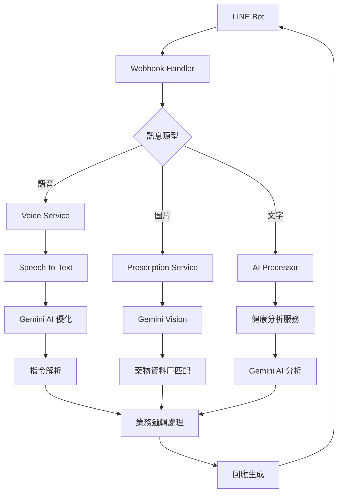

# 🏥 智能藥品管理 LINE Bot

<div align="center">


**一個功能完整的 LINE Bot 智能藥品管理系統**

[功能特色](#-主要功能) • [快速開始](#-快速開始) • [技術架構](#-技術架構) • [語音功能](#-語音快捷鍵功能) • [健康分析](#-健康分析功能) • [部署指南](#-cicd-與部署)

</div>

## ✨ 主要功能

### 🔬 核心功能
- 📋 **藥單辨識**: 使用 Gemini AI 自動辨識藥單照片，支援多種處方格式
- 💊 **藥品辨識**: 智能識別藥品外觀，提供詳細藥物資訊
- ⏰ **智能提醒**: 多層級用藥提醒系統，支援複雜用藥時程
- 👨‍👩‍👧‍👦 **家庭管理**: 完整的家庭成員健康管理功能
- 🗂️ **藥歷追蹤**: 完整的用藥記錄與歷史查詢

### 🎙️ 語音智能
- **語音指令**: 支援自然語言語音操作，包含 50+ 種指令
- **語音新增**: 語音快速新增提醒對象和用藥提醒
- **AI 優化**: Gemini AI 自動修正語音識別錯誤
- **快取機制**: 語音處理結果快取，提升響應速度

### 📊 健康分析
- **AI 健康洞察**: 基於 Gemini AI 的個人化健康分析
- **趨勢監測**: 自動分析健康數據變化趨勢
- **風險評估**: 智能健康風險評分與預警
- **個人化建議**: 根據健康狀況提供客製化建議

### 🤖 AI 增強功能
- **智能對話**: 基於 Google Gemini 2.5 Flash 的對話系統
- **文字優化**: 自動修正語音轉文字的常見錯誤
- **健康評分**: AI 驅動的健康狀況評分系統
- **預測分析**: 健康趨勢預測與異常檢測

## 🏗️ 技術架構

### 後端技術棧
- **應用框架**: [`Flask 3.1.1`](run.py:16) - 現代化 Web 框架
- **資料庫**: MySQL 8.0+ - 關聯式資料庫
- **AI 引擎**: Google Gemini 2.5 Flash - 最新 AI 模型
- **語音服務**: Google Cloud Speech-to-Text API
- **訊息平台**: LINE Bot SDK 3.17.1

### 前端與介面
- **LIFF 框架**: LINE Front-end Framework
- **響應式設計**: 支援多種裝置尺寸
- **即時互動**: WebSocket 即時通訊

### 雲端與部署
- **容器化**: Docker + Docker Compose
- **雲端平台**: Google Cloud Run
- **CI/CD**: GitHub Actions 自動化部署
- **監控**: 健康檢查與效能監控

## 🚀 快速開始

### 環境需求

- Python 3.11+
- MySQL 8.0+
- Docker (可選)

## 🔧 配置說明

### 必要環境變數

```bash
# LINE Bot API 設定
LINE_CHANNEL_ACCESS_TOKEN=your_access_token
LINE_CHANNEL_SECRET=your_channel_secret
YOUR_BOT_ID=@your_bot_id

# LIFF 應用程式設定
LIFF_CHANNEL_ID=your_liff_channel_id
LIFF_ID_CAMERA=your_camera_liff_id
LIFF_ID_EDIT=your_edit_liff_id
LIFF_ID_PRESCRIPTION_REMINDER=your_prescription_reminder_liff_id
LIFF_ID_MANUAL_REMINDER=your_manual_reminder_liff_id
LIFF_ID_HEALTH_FORM=your_health_form_liff_id

# LINE Login 設定
LINE_LOGIN_CHANNEL_ID=your_login_channel_id
LINE_LOGIN_CHANNEL_SECRET=your_login_channel_secret

# Google Gemini API 設定
GEMINI_API_KEY=your_gemini_api_key

# Google Cloud Speech-to-Text 設定 (語音識別)
GOOGLE_APPLICATION_CREDENTIALS=path/to/service-account-key.json
SPEECH_TO_TEXT_ENABLED=true

# MySQL 資料庫設定
DB_HOST=your_db_host
DB_USER=your_db_user
DB_PASS=your_db_password
DB_NAME=your_db_name
DB_PORT=3306

# Flask 設定
SECRET_KEY=your_secret_key
```

## 🎙️ 語音快捷鍵功能

### 🚀 超快速語音處理
採用激進優化策略，語音處理時間 < 3 秒，提供流暢的使用體驗。

#### 完整語音指令支援

| 功能類別 | 範例語音指令 | 處理方式 |
|---------|-------------|---------|
| **設定用藥提醒** | 「新增用藥提醒，普拿疼，早上九點，每次一顆」<br>「新增提醒，晚上八點吃一顆血壓藥」 | 智能解析藥名、時間、劑量 |
| **查詢提醒** | 「查詢本人」「我的提醒」<br>「查詢家人」「家人提醒」 | 快速檢索並顯示 |
| **新增提醒對象** | 「新增提醒對象媽媽」<br>「新增家人爸爸」 | 語音直接新增成員 |


#### 🔧 技術特色

##### 多層級語音處理架構
```python
# 語音處理流程 (app/services/voice_service.py)
1. 快速指令檢測 → 短音檔直接匹配
2. 音檔格式轉換 → 智能格式檢測與快取
3. 超快速識別 → 簡化配置，提升速度
4. AI 智能優化 → Gemini 2.5 Flash 錯字修正
5. 指令解析執行 → 正則匹配 + 業務邏輯
```

##### 智能快取系統
- **語音快取**: 5分鐘快取機制，避免重複處理
- **轉錄快取**: 相同音檔直接返回結果
- **指令快取**: 常用指令快速響應

##### AI 增強處理
- **Gemini 優化**: [`_enhance_with_gemini_fast()`](app/services/voice_service.py:455) 快速錯字修正
- **本地備援**: [`_local_text_optimization()`](app/services/voice_service.py:587) 離線文字優化
- **醫療詞彙**: 50+ 醫療相關詞彙預設支援

#### 🎯 使用方式

1. **語音錄製**: LINE 對話中長按麥克風
2. **自然發音**: 支援台灣國語、方言混合
3. **即時回饋**: 3秒內完成處理並回應
4. **錯誤容忍**: 自動修正常見語音識別錯誤

## 📊 健康分析功能

### 🧠 AI 驅動的健康洞察
基於 [`HealthAnalysisService`](app/services/health_analysis_service.py:14) 提供專業級健康分析。

#### 核心分析能力

##### 🔍 多維度健康評估
- **趨勢分析**: 自動計算各項指標的變化趨勢
- **異常檢測**: 智能識別異常數值和模式
- **風險評分**: 0-100 分健康風險評估
- **個人化洞察**: 基於個人數據的客製化分析

##### 📈 支援的健康指標
```python
# 完整支援的健康數據類型
健康指標 = {
    '體重': '趨勢分析 + BMI 計算',
    '血壓': '收縮壓/舒張壓分析 + 高血壓風險',
    '血糖': '糖尿病風險評估 + 飯前飯後分析',
    '體溫': '發燒檢測 + 異常溫度警示',
    '血氧': '呼吸系統健康評估'
}
```

#### 🤖 AI 分析引擎

##### 智能洞察生成
- **Gemini 分析**: [`_generate_health_insights()`](app/services/health_analysis_service.py:180) 專業健康洞察
- **風險識別**: [`_analyze_health_risks()`](app/services/health_analysis_service.py:671) 多層級風險評估
- **建議生成**: [`_generate_recommendations()`](app/services/health_analysis_service.py:379) 個人化健康建議

##### 增強基本分析
當 AI 服務不可用時，系統自動切換至增強基本分析模式：
- **統計分析**: 平均值、趨勢、異常率計算
- **規則引擎**: 基於醫學標準的健康評估
- **本地建議**: 預設健康建議庫

#### 📊 分析結果展示

```json
{
  "insights": [
    {
      "type": "trend",
      "message": "您的血壓呈現下降趨勢，較前期有所改善"
    }
  ],
  "scores": {
    "overall": 85,
    "bloodPressure": 90,
    "bloodSugar": 80
  },
  "recommendations": [
    {
      "title": "血壓管理",
      "content": "建議維持目前的生活方式",
      "priority": "medium"
    }
  ]
}
```

## 📁 專案架構

### 🏗️ 目錄結構
```
LINE_Bot_Developer/
├── app/                           # 主應用程式
│   ├── routes/                    # 路由層
│   │   ├── handlers/              # 業務邏輯處理器
│   │   │   ├── family_handler.py  # 家庭管理
│   │   │   ├── pill_handler.py    # 藥品識別
│   │   │   ├── prescription_handler.py # 藥單處理
│   │   │   └── reminder_handler.py # 提醒管理
│   │   ├── auth.py                # 身份認證
│   │   ├── liff_views.py          # LIFF 前端視圖
│   │   ├── line_webhook.py        # LINE Webhook
│   │   └── scheduler_api.py       # 排程 API
│   ├── services/                  # 服務層
│   │   ├── voice_service.py       # 🎙️ 語音處理服務
│   │   ├── health_analysis_service.py # 📊 健康分析服務
│   │   ├── ai_processor.py        # 🤖 AI 處理引擎
│   │   ├── reminder_service.py    # ⏰ 提醒服務
│   │   ├── prescription_service.py # 📋 藥單服務
│   │   ├── family_service.py      # 👨‍👩‍👧‍👦 家庭服務
│   │   └── user_service.py        # 👤 用戶服務
│   ├── templates/                 # HTML 模板
│   │   ├── camera.html            # 相機介面
│   │   ├── health_form.html       # 健康記錄表單
│   │   └── *_reminder_form.html   # 提醒設定表單
│   └── utils/                     # 工具模組
│       ├── db.py                  # 資料庫工具
│       ├── helpers.py             # 輔助函數
│       └── flex/                  # LINE Flex Message 模板
├── .github/workflows/             # CI/CD 自動化
├── config.py                      # 🔧 應用程式配置
├── run.py                         # 🚀 應用程式入口
├── requirements.txt               # 📦 Python 依賴
├── Dockerfile                     # 🐳 容器配置
└── docker-compose.yml             # 🐳 本地開發環境
```

### 🔄 服務架構圖


## 🔄 CI/CD 與部署

### 🚀 自動化部署流程
採用 GitHub Actions 實現完全自動化的 CI/CD 管道：

#### 主要工作流程
1. **代碼品質檢查** - 自動化測試與程式碼分析
2. **Docker 建構** - 多階段建構優化映像大小
3. **安全掃描** - 依賴漏洞與容器安全檢測
4. **自動部署** - 零停機時間部署到 Google Cloud Run

#### 部署環境管理
- **開發環境**: `develop` 分支 → 自動部署到 staging
- **生產環境**: `main` 分支 → 自動部署到 production
- **健康檢查**: [`/health`](run.py:19) 端點監控服務狀態

### ⚡ 效能優化

#### 雲端架構優化
- **Cloud Run**: 自動擴縮容，按需付費
- **Cloud Scheduler**: [`scheduler_api.py`](app/routes/scheduler_api.py:10) 定時任務管理
- **負載均衡**: 多區域部署，提升可用性

#### 應用程式優化
- **快取策略**: 語音識別結果快取，減少 API 調用
- **並行處理**: 異步處理提升響應速度
- **資源管理**: 智能資源分配與回收

### 🔒 安全性措施

#### 多層級安全防護
- **API 金鑰管理**: GitHub Secrets 安全存儲
- **請求驗證**: LINE Webhook 簽名驗證
- **存取控制**: 基於角色的權限管理
- **資料加密**: 敏感資料傳輸與存儲加密

#### 安全監控
- **依賴掃描**: Dependabot 自動更新
- **容器安全**: 定期映像漏洞掃描
- **存取日誌**: 完整的操作審計追蹤


## 🚀 快速開始

### 📋 環境需求
- **Python**: 3.11+
- **MySQL**: 8.0+
- **Docker**: 20.10+ (可選)
- **Node.js**: 16+ (開發工具)

### ⚙️ 本地開發設置

1. **克隆專案**
   ```bash
   git clone https://github.com/your-username/LINE_Bot_Developer.git
   cd LINE_Bot_Developer
   ```

2. **環境配置**
   ```bash
   # 複製環境變數範本
   cp .env.example .env
   
   # 編輯 .env 檔案，填入您的 API 金鑰
   nano .env
   ```

3. **安裝依賴**
   ```bash
   # 使用 pip
   pip install -r requirements.txt
   
   # 或使用 Docker
   docker-compose up -d
   ```

4. **啟動應用程式**
   ```bash
   # 本地開發
   python run.py
   
   # 或使用 Docker
   docker-compose up app
   ```

### 🔧 必要環境變數

```bash
# LINE Bot API 設定
LINE_CHANNEL_ACCESS_TOKEN=your_access_token
LINE_CHANNEL_SECRET=your_channel_secret
YOUR_BOT_ID=@your_bot_id

# LIFF 應用程式設定
LIFF_CHANNEL_ID=your_liff_channel_id
LIFF_ID_CAMERA=your_camera_liff_id
LIFF_ID_EDIT=your_edit_liff_id
LIFF_ID_PRESCRIPTION_REMINDER=your_prescription_reminder_liff_id
LIFF_ID_MANUAL_REMINDER=your_manual_reminder_liff_id
LIFF_ID_HEALTH_FORM=your_health_form_liff_id

# LINE Login 設定
LINE_LOGIN_CHANNEL_ID=your_login_channel_id
LINE_LOGIN_CHANNEL_SECRET=your_login_channel_secret

# Google AI 服務
GEMINI_API_KEY=your_gemini_api_key
GOOGLE_APPLICATION_CREDENTIALS=path/to/service-account-key.json
SPEECH_TO_TEXT_ENABLED=true

# MySQL 資料庫設定
DB_HOST=your_db_host
DB_USER=your_db_user
DB_PASS=your_db_password
DB_NAME=your_db_name
DB_PORT=3306

# Flask 應用程式
SECRET_KEY=your_secret_key
```

## 📚 API 文檔

### 🔗 主要端點

| 端點 | 方法 | 描述 | 範例 |
|------|------|------|------|
| `/callback` | POST | LINE Webhook 接收端點 | LINE 平台調用 |
| `/api/check-reminders` | POST | 定時提醒檢查 | Cloud Scheduler 調用 |
| `/health` | GET | 健康檢查端點 | 服務監控使用 |
| `/liff/*` | GET | LIFF 應用程式頁面 | 前端介面 |

### 📊 健康檢查 API

```bash
# 基本健康檢查
curl https://your-domain.com/health

# 詳細健康檢查
curl https://your-domain.com/api/health-detailed
```

回應範例：
```json
{
  "status": "healthy",
  "timestamp": "2024-01-01T12:00:00Z",
  "database": "connected",
  "version": "1.0.0"
}
```

## 📈 效能監控

### 🔍 關鍵指標
- **語音處理時間**: < 3 秒
- **AI 分析響應**: < 5 秒
- **資料庫查詢**: < 100ms
- **系統可用性**: > 99.9%

### 📊 監控工具
- **健康檢查**: 自動化服務狀態監控
- **日誌分析**: 結構化日誌記錄與分析
- **效能追蹤**: API 響應時間監控
- **錯誤追蹤**: 異常自動通知與處理

## 🙏 致謝

### 🌟 核心技術
- [LINE Developers](https://developers.line.biz/) - LINE Bot 平台
- [Google Gemini](https://ai.google.dev/) - AI 分析引擎
- [Google Cloud Speech-to-Text](https://cloud.google.com/speech-to-text) - 語音識別
- [Flask](https://flask.palletsprojects.com/) - Web 框架
- [Google Cloud Run](https://cloud.google.com/run) - 雲端部署

---

<div align="center">

**⚠️ 重要提醒**

本系統僅供健康管理參考，不可替代專業醫療建議。
請確保在生產環境中妥善保護您的 API 金鑰和敏感資訊。


</div>
